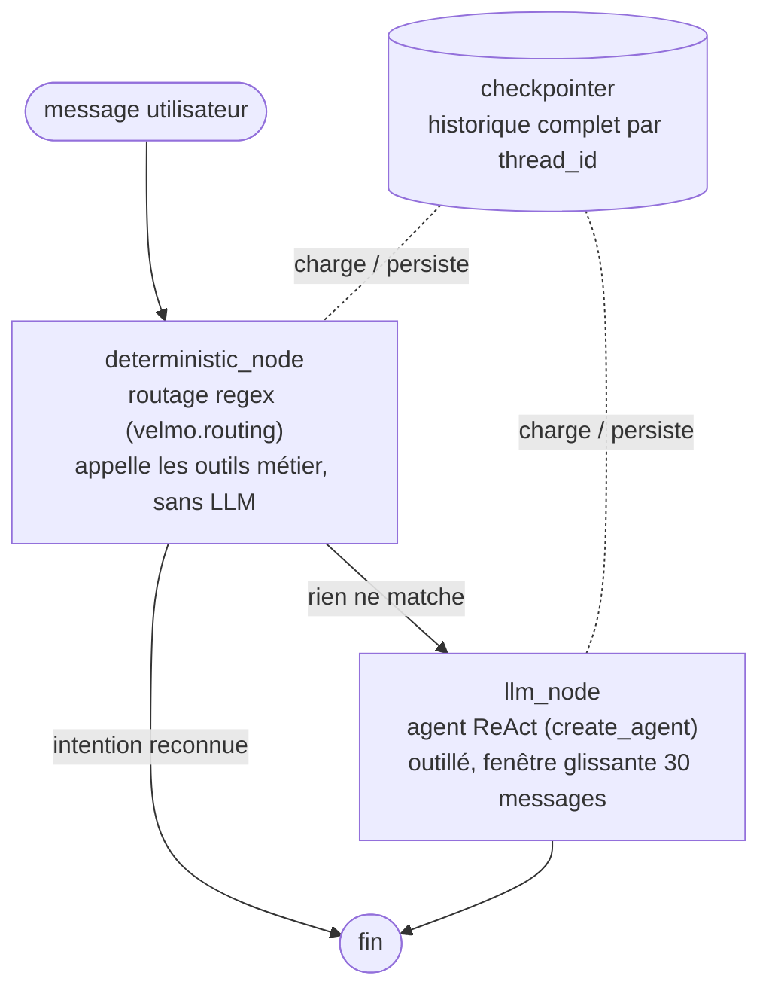

# Velmo V2

Assistant de support pour **Velmo**, boutique en ligne de maillots de foot collector (rééditions vintage, pièces signées, éditions limitées en stock très limité). L'agent traite la gestion de commandes de niveau 1 — statut et suivi, disponibilité, modification/annulation avant expédition, retours, remboursements simples, FAQ — en gardant le contexte du client dans le temps.

## Features

- Outils métier connectés à la base : commandes, suivi, stock, retours, remboursements, escalade
- Garde-fous métier intégrés : isolation par client, blocage des modifications après expédition, plafond de remboursement (50 €) avec escalade
- FAQ par recherche sémantique (RAG) sur la base de connaissances Velmo
- Mémoire durable et isolée par client : extraction automatique des faits durables (FactStore Chroma/local), droit à l'oubli (RGPD) et inspection
- Garde-fous de contenu en entrée/sortie (à construire)
- Chaîne qualité MLOps : évaluation, note globale, seuil bloquant en CI (à construire)

## Stack

- Python 3.11 (géré avec `uv`)
- PostgreSQL + SQLAlchemy 2 + Alembic (état des commandes, clients, catalogue)
- Chroma + `intfloat/multilingual-e5-small` pour la FAQ (extra `vector`)
- Azure AI Inference (Kimi-K2.6) pour le LLM (extra `llm`)
- GitHub Actions pour l'intégration continue

Le coeur tourne sans service externe (repli hors-ligne : SQLite en mémoire pour les
tests, FAQ locale, LLM en écho). Les intégrations s'activent via les extras :

```bash
uv sync                                   # coeur + base + outils de dev
uv sync --extra vector --extra llm        # Chroma + Azure AI Inference
```

## Démarrage

```bash
make up           # docker compose : app + postgres + chroma
make seed         # peuple Postgres (catalogue, clients, ~14 commandes)
make chat         # REPL — répond déjà aux questions métier de base
```

Exemple de session (`make chat`, client `C-marc-dubois` par défaut) :

```
Vous : Quel est le statut de ma commande O-2024-0101 ?
Velmo : Votre commande O-2024-0101 est au statut « prepared ».
Vous : Le maillot france-1998 en taille L est-il disponible ?
Velmo : Le maillot France 1998 — Zidane en taille L est disponible.
Vous : Quels sont les frais de port en France ?
Velmo : D'après notre FAQ (frais-de-port.md) : France métropolitaine : 6,90 € …
```

À ce stade l'agent sait parler à la base et à la FAQ, **mais sans mémoire durable,
sans garde-fous de contenu et sans chaîne qualité** — c'est ce qui reste à construire.

## Graphe de l'agent

`src/velmo/agent_graph.py` assemble l'agent comme un `StateGraph` LangGraph à
deux nœuds, compilé avec un checkpointer (mémoire court terme, thread_id =
`user_id`) qui charge/persiste l'historique à chaque tour :



- **`deterministic_node`** : chemin rapide par expressions régulières (numéro
  de commande, mots-clés d'intention). S'il produit une réponse, le graphe
  s'arrête directement (`route` renvoie `END`).
- **`llm_node`** : atteint uniquement si aucune règle ne matche. Agent ReAct
  outillé avec les 10 outils métier, dont le prompt est borné aux 30 derniers
  messages (`window_messages`) — la persistance, elle, garde tout l'historique.
- Le **checkpointer** (`InMemorySaver` hors-ligne, `PostgresSaver` si `DB_URL`)
  n'est pas un nœud du graphe : c'est l'état compilé (`graph.compile(checkpointer=...)`),
  lu et écrit automatiquement à chaque `graph.invoke`, keyé par `thread_id`.

## Layout

```
src/velmo/
  cli.py            REPL de conversation (--user)
  agent.py          Orchestration : garde-fous → mémoire → outils → réponse
  llm.py            Client Azure AI Inference (+ repli hors-ligne)
  db.py             Schéma SQLAlchemy + sessions
  sampledata.py     Jeu de données de référence
  tools/            10 outils métier (accès Postgres + FAQ)
  memory/           Mémoire court terme (checkpointer) + long terme (FactStore, faits, oubli, inspection)
  guardrails/       Garde-fous de contenu entrée/sortie (à construire)
  mlops/            Évaluation, note globale, seuil, rapport (à construire)
docs/reco_expert.md Note de recommandations (stack + exigences)
kb/docs/            Base de connaissances FAQ
scripts/            seed.py (Postgres) + seed_kb.py (Chroma)
alembic/            Migrations
eval/               Jeux de cas (mémoire, garde-fous, qualité)
tests/acceptance/   Suite d'acceptance + tests métier
.github/workflows/  Intégration continue
```

## Commandes utiles

```bash
make migrate    # alembic upgrade head
make seed-kb    # ingestion FAQ dans Chroma
make test       # suite d'acceptance + tests métier
make fmt        # ruff format + autofix
make typecheck  # mypy
make down       # arrête les services
```

## License

Propriétaire — Velmo.
