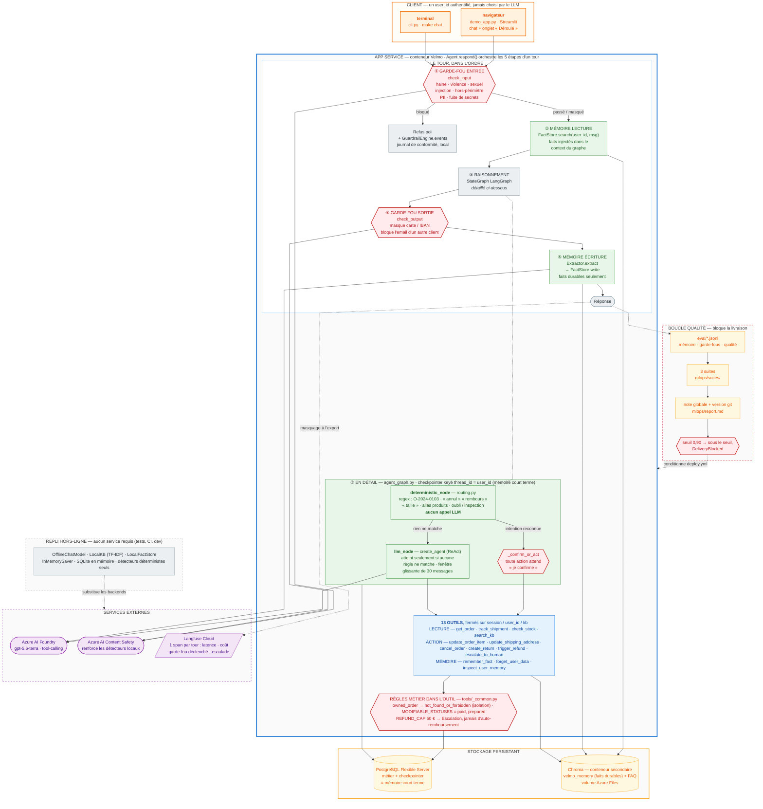

# Velmo V2

Assistant de support pour **Velmo**, boutique en ligne de maillots de foot collector (rééditions vintage, pièces signées, éditions limitées en stock très limité). L'agent traite la gestion de commandes de niveau 1 — statut et suivi, disponibilité, modification/annulation avant expédition, retours, remboursements simples, FAQ — en gardant le contexte du client dans le temps.

---

> **Agent de support e-commerce en production sur Azure** : mémoire persistante isolée par
> client, garde-fous en entrée et en sortie, et une note de qualité qui bloque la livraison
> en CI sous 0,90. Postgres pour l'état métier, Chroma pour la mémoire long terme et la FAQ.

Reconstruit de zéro sur un brief imposé ([`docs/brief.md`](docs/brief.md)) et une suite
d'acceptance fournie d'avance, puis mis en ligne sur un second brief
([`docs/brief-azure.md`](docs/brief-azure.md)). Les trois exigences non négociables du
brief — mémoire (R1–R6), garde-fous, qualité mesurée — sont les trois modules ci-dessous.


```mermaid
%%{init: { 'theme': 'default', 'flowchart': { 'curve': 'linear', 'wrappingWidth': 460, 'nodeSpacing': 40, 'rankSpacing': 45 } } }%%
flowchart TB
  subgraph users["CLIENT — un user_id authentifié, jamais choisi par le LLM"]
    direction LR
    udemo["<b>navigateur</b><br>demo_app.py · Streamlit<br>chat + onglet « Déroulé »"]
    ucli["<b>terminal</b><br>cli.py · make chat"]
  end

  udemo & ucli --> gin

  subgraph app["APP SERVICE — conteneur Velmo · Agent.respond() orchestre les 5 étapes d'un tour"]
    direction TB

    subgraph pipe["LE TOUR, DANS L'ORDRE"]
      direction LR
      gin{{"① GARDE-FOU ENTRÉE<br>check_input<br>haine · violence · sexuel<br>injection · hors-périmètre<br>PII · fuite de secrets"}}
      mread["② MÉMOIRE LECTURE<br>FactStore.search(user_id, msg)<br>faits injectés dans le<br>context du graphe"]
      graphn["③ RAISONNEMENT<br>StateGraph LangGraph<br><i>détaillé ci-dessous</i>"]
      gout{{"④ GARDE-FOU SORTIE<br>check_output<br>masque carte / IBAN<br>bloque l'email d'un autre client"}}
      mwrite["⑤ MÉMOIRE ÉCRITURE<br>Extractor.extract<br>→ FactStore.write<br>faits durables seulement"]
      rep(["Réponse"])
      gin -- "passé / masqué" --> mread --> graphn --> gout --> mwrite --> rep
      gin -- "bloqué" --> refus["Refus poli<br>+ GuardrailEngine.events<br>journal de conformité, local"]
    end

    subgraph agentgraph["③ EN DÉTAIL — agent_graph.py · checkpointer keyé thread_id = user_id (mémoire court terme)"]
      direction LR
      det["<b>deterministic_node</b> — routing.py<br>regex : O-2024-0103 · « annul » « rembours »<br>« taille » · alias produits · oubli / inspection<br><b>aucun appel LLM</b>"]
      conf{{"_confirm_or_act<br>toute action attend<br>« je confirme »"}}
      llm["<b>llm_node</b> — create_agent (ReAct)<br>atteint seulement si aucune<br>règle ne matche · fenêtre<br>glissante de 30 messages"]
      det -- "intention reconnue" --> conf
      det -- "rien ne matche" --> llm
    end

    tools["<b>13 OUTILS</b>, fermés sur session / user_id / kb<br>LECTURE — get_order · track_shipment · check_stock · search_kb<br>ACTION — update_order_item · update_shipping_address · cancel_order · create_return · trigger_refund · escalate_to_human<br>MÉMOIRE — remember_fact · forget_user_data · inspect_user_memory"]

    rules{{"RÈGLES MÉTIER DANS L'OUTIL — tools/_common.py<br>owned_order → not_found_or_forbidden (isolation) · MODIFIABLE_STATUSES = paid, prepared<br>REFUND_CAP 50 € → Escalation, jamais d'auto-remboursement"}}

    graphn -.- det
    conf & llm --> tools
    tools --> rules
  end

  subgraph data["STOCKAGE PERSISTANT"]
    direction LR
    pg[("PostgreSQL Flexible Server<br>métier + checkpointer<br>= mémoire court terme")]
    chroma[("Chroma — conteneur secondaire<br>velmo_memory (faits durables) + FAQ<br>volume Azure Files")]
  end

  subgraph ext["SERVICES EXTERNES"]
    direction LR
    foundry(["Azure AI Foundry<br>gpt-5.6-terra · tool-calling"])
    safety(["Azure AI Content Safety<br>renforce les détecteurs locaux"])
    lf[/"Langfuse Cloud<br>1 span par tour : latence · coût<br>garde-fou déclenché · escalade"/]
  end

  rules --> pg
  agentgraph --> pg
  mread & mwrite --> chroma
  tools --> chroma
  llm & mwrite --> foundry
  gin & gout --> safety
  rep -.->|"masquage à l'export"| lf

  subgraph offline["REPLI HORS-LIGNE — aucun service requis (tests, CI, dev)"]
    direction LR
    off["OfflineChatModel · LocalKB (TF-IDF) · LocalFactStore<br>InMemorySaver · SQLite en mémoire · détecteurs déterministes seuls"]
  end
  off -.->|"substitue les backends"| ext

  subgraph quality["BOUCLE QUALITÉ — bloque la livraison"]
    direction LR
    cases["eval/*.jsonl<br>mémoire · garde-fous · qualité"] --> suites["3 suites<br>mlops/suites/"] --> note["note globale + version git<br>mlops/report.md"] --> gate{{"seuil 0,90 → sous le seuil,<br>DeliveryBlocked"}}
  end
  rep -.-> cases
  gate -.->|"conditionne deploy.yml"| app

  classDef acteur   fill:#fff3e0,stroke:#ef6c00,stroke-width:2px,color:#e65100
  classDef orchestr fill:#eceff1,stroke:#78909c,stroke-width:1px,color:#263238
  classDef facade   fill:#e3f2fd,stroke:#1976d2,stroke-width:1px,color:#0d47a1
  classDef metier   fill:#e8f5e9,stroke:#388e3c,stroke-width:1px,color:#1b5e20
  classDef donnees  fill:#fff8e1,stroke:#f9a825,stroke-width:1px,color:#e65100
  classDef externe  fill:#f3e5f5,stroke:#8e24aa,stroke-width:1px,color:#4a148c
  classDef controle fill:#ffebee,stroke:#c62828,stroke-width:2px,color:#b71c1c

  class udemo,ucli acteur
  class rep,refus,off,graphn orchestr
  class tools facade
  class det,llm,mread,mwrite metier
  class pg,chroma,cases,suites,note donnees
  class foundry,safety,lf externe
  class gin,gout,conf,rules,gate controle

  style app fill:#fafafa,stroke:#1976d2,stroke-width:3px
  style pipe fill:#ffffff,stroke:#90caf9,stroke-width:1px
  style agentgraph fill:#e8f5e9,stroke:#388e3c,stroke-width:1px
  style users fill:#fffdf7,stroke:#ef6c00,stroke-width:2px
  style data fill:#fafafa,stroke:#f9a825,stroke-width:2px
  style ext fill:#fafafa,stroke:#8e24aa,stroke-dasharray: 5 5
  style offline fill:#fafafa,stroke:#bdbdbd,stroke-dasharray: 5 5
  style quality fill:#fafafa,stroke:#c62828,stroke-dasharray: 6 4
```

<p align="center"><em>Un tour, de bout en bout : les cinq étapes de <code>Agent.respond()</code>, le graphe
en détail, les backends réels et leur repli hors-ligne, et la boucle qualité qui conditionne
le déploiement.</em></p>

| Ce que le projet a demandé | Où le lire |
|---|---|
| **Mémoire d'agent sur six exigences** : court terme par checkpointer LangGraph keyé sur l'utilisateur, long terme en faits typés (sémantique vs épisodique) avec extraction à chaque tour — donc rien de perdu au-delà de la fenêtre —, isolation, droit à l'oubli RGPD et inspection | [`memory/`](src/velmo/memory/), [`fact_store.py`](src/velmo/memory/fact_store.py), [`extract.py`](src/velmo/memory/extract.py), [`memory_tools.py`](src/velmo/tools/memory_tools.py) |
| **Garde-fous en deux étages** : détecteurs déterministes hors-ligne (injection, hors-périmètre, PII par Luhn/IBAN, fuite de secrets) renforcés par Azure AI Content Safety en prod, masquage plutôt que blocage quand c'est possible, et un journal de conformité qui reste local | [`guardrails/engine.py`](src/velmo/guardrails/engine.py), [`detectors.py`](src/velmo/guardrails/detectors.py), [`content_safety.py`](src/velmo/guardrails/content_safety.py) |
| **Évaluation et gate de livraison** : trois suites rejouées sur `eval/*.jsonl`, note globale versionnée par tag git, seuil bloquant en CI, et un agent volontairement dégradé qui doit noter *moins* — la preuve que le gate détecte une régression | [`mlops/`](src/velmo/mlops/), [`suites/`](src/velmo/mlops/suites/), [`eval.yml`](.github/workflows/eval.yml), [`test_mlops.py`](tests/acceptance/test_mlops.py) |
| **Routage déterministe avant le LLM** : regex d'intention et de numéro de commande traitent la majorité des tours sans appel de modèle ; le nœud LLM outillé (ReAct, 13 outils : 10 métier + 3 mémoire) n'est atteint que si rien ne matche — moins de coût, moins de surface d'hallucination | [`agent_graph.py`](src/velmo/agent_graph.py), [`routing.py`](src/velmo/routing.py), [`agent_tools.py`](src/velmo/agent_tools.py) |
| **Règles métier dans l'outil, pas à côté** : isolation par propriétaire de commande, modification interdite après expédition, plafond de remboursement à 50 € — chaque dépassement crée une escalade au lieu d'échouer en silence | [`tools/_common.py`](src/velmo/tools/_common.py), [`tools/refunds.py`](src/velmo/tools/refunds.py), [`tools/orders.py`](src/velmo/tools/orders.py) |
| **Observabilité de production** : Langfuse (un span par tour, tokens, coût, latence, catégorie de garde-fou déclenchée) avec masquage à l'export, doublée d'un `TurnLog` in-process qui voit ce qui tourne hors du graphe | [`observability.py`](src/velmo/observability.py), [`turn_log.py`](src/velmo/turn_log.py), [`infra/README.md`](infra/README.md) |
| **Déploiement et CI/CD** : image construite dans ACR, connexion Azure par OIDC (aucun credential stocké), déploiement conditionné à la réussite du gate d'éval sur le tag, rollback en repointant le tag `latest` | [`deploy.yml`](.github/workflows/deploy.yml), [`release.yml`](.github/workflows/release.yml), [`Dockerfile`](Dockerfile), [`docs/dossier-deploiement-azure.md`](docs/dossier-deploiement-azure.md) |

**Mesuré, pas affirmé** — note globale **0,954** (mémoire 0,917 · blocage des catégories
interdites 1,000 · faux positifs 0,000 sur 35 cas · qualité 1,000) pour un seuil bloquant
à 0,90, et **246 tests passent** (`uv sync --extra obs && make test`). Chiffres régénérables
par `make eval`, qui écrit une ligne par version dans `mlops/report.md`.

---

## Stack

- Python 3.11 (géré avec `uv`)
- PostgreSQL + SQLAlchemy 2 + Alembic (état des commandes, clients, catalogue)
- Chroma + `intfloat/multilingual-e5-small` pour la FAQ (extra `vector`)
- Azure AI Inference (gpt-5.6-terra) pour le LLM (extra `llm`)
- GitHub Actions pour l'intégration continue

Le coeur tourne sans service externe (repli hors-ligne : SQLite en mémoire pour les
tests, FAQ locale, LLM en écho). Les intégrations s'activent via les extras :

```bash
uv sync                                   # coeur + base + outils de dev
uv sync --extra vector --extra llm        # Chroma + Azure AI Inference
```

## Démarrage

```bash
make up           # docker compose : app + postgres + chroma
make seed         # peuple Postgres (catalogue, clients, ~14 commandes)
make chat         # REPL de conversation
```

Exemple de session (`make chat`, client `C-marc-dubois` par défaut) :

```
Vous : Quel est le statut de ma commande O-2024-0101 ?
Velmo : Votre commande O-2024-0101 est au statut « prepared ».
Vous : Le maillot france-1998 en taille L est-il disponible ?
Velmo : Le maillot France 1998 — Zidane en taille L est disponible.
Vous : Quels sont les frais de port en France ?
Velmo : D'après notre FAQ (frais-de-port.md) : France métropolitaine : 6,90 € …
```

L'interface de démonstration Streamlit (`make demo`) ajoute un onglet « 🔍 Déroulé » qui
montre, tour par tour, le verdict des garde-fous, les faits mémoire lus et écrits, le
chemin pris dans le graphe et les appels d'outils.

## Graphe de l'agent

`src/velmo/agent_graph.py` assemble l'agent comme un `StateGraph` LangGraph à deux nœuds
(étape ③ du schéma), compilé avec un checkpointer (mémoire court terme, thread_id =
`user_id`) qui charge et persiste l'historique à chaque tour :

- **`deterministic_node`** : chemin rapide par expressions régulières (numéro
  de commande, mots-clés d'intention). S'il produit une réponse, le graphe
  s'arrête directement (`route` renvoie `END`).
- **`llm_node`** : atteint uniquement si aucune règle ne matche. Agent ReAct
  outillé avec les 10 outils métier, dont le prompt est borné aux 30 derniers
  messages (`window_messages`) — la persistance, elle, garde tout l'historique.
- Le **checkpointer** (`InMemorySaver` hors-ligne, `PostgresSaver` si `DB_URL`)
  n'est pas un nœud du graphe : c'est l'état compilé (`graph.compile(checkpointer=...)`),
  lu et écrit automatiquement à chaque `graph.invoke`, keyé par `thread_id`.

## Layout

```
src/velmo/
  cli.py            REPL de conversation (--user)
  agent.py          Orchestration : garde-fous → mémoire → outils → réponse
  llm.py            Client Azure AI Inference (+ repli hors-ligne)
  db.py             Schéma SQLAlchemy + sessions
  sampledata.py     Jeu de données de référence
  tools/            10 outils métier (accès Postgres + FAQ)
  memory/           Mémoire court terme (checkpointer) + long terme (FactStore, faits, oubli, inspection)
  guardrails/       Garde-fous de contenu entrée/sortie (détecteurs locaux + Content Safety)
  mlops/            Évaluation (3 suites), note globale, seuil bloquant, rapport
  observability.py  Traçage Langfuse (NoOpTracer sans clés)
  turn_log.py       Journal in-process d'un tour (alimente la démo et les tests)
docs/               Briefs, note de recommandations, specs de conception, schémas
infra/README.md     Runbook Azure (topologie, config, déploiement, rollback)
kb/docs/            Base de connaissances FAQ
scripts/            seed.py (Postgres) + seed_kb.py (Chroma)
alembic/            Migrations
eval/               Jeux de cas (mémoire, garde-fous, qualité)
tests/acceptance/   Suite d'acceptance + tests métier
.github/workflows/  Intégration continue
```

## Déploiement

Une **seule App Service** (Web App for Containers) fait tourner deux conteneurs : l'image
Velmo et un **conteneur secondaire Chroma** dont les données sont montées sur Azure Files —
c'est ce volume qui rend la mémoire long terme persistante et partagée entre postes. Postgres
est un Flexible Server managé, le LLM et la modération sont des ressources Azure AI, et tous
les secrets vivent dans les paramètres d'application.

<p align="center">
  <a href="docs/img/deploiement-azure.png">
    
  </a>
  <br><em>Schéma de déploiement cible — cliquer pour agrandir.</em>
</p>

Conception et justification des choix de services :
[`docs/dossier-deploiement-azure.md`](docs/dossier-deploiement-azure.md). Runbook
d'exploitation (configuration, déploiement, rollback, journaux) :
[`infra/README.md`](infra/README.md).

## Commandes utiles

```bash
make migrate    # alembic upgrade head
make seed-kb    # ingestion FAQ dans Chroma
make test       # suite complète (246 tests)
make eval       # évaluation + note globale + écriture de mlops/report.md
make demo       # interface Streamlit avec le déroulé d'un tour
make fmt        # ruff format + autofix
make typecheck  # mypy
make down       # arrête les services
```

## License

Propriétaire — Velmo.
