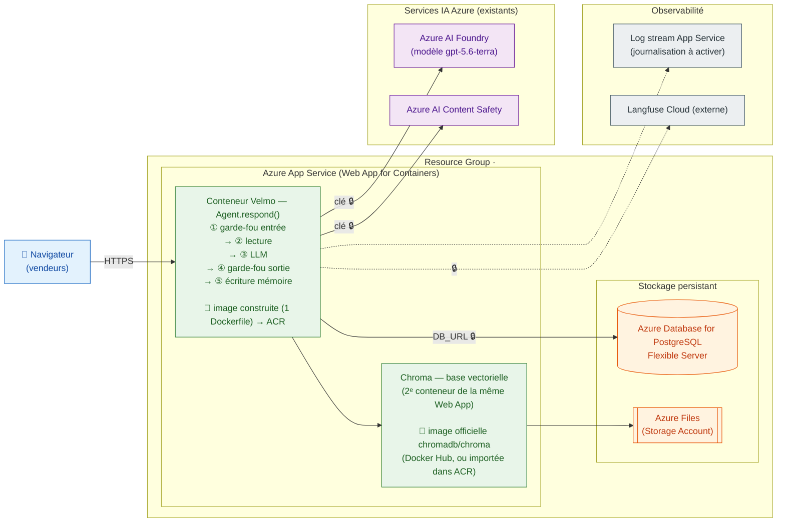

# Dossier de déploiement — Velmo 2.0 sur Azure

> **Statut : brouillon à valider par le formateur (porte d'entrée avant toute mise en ligne).**
> Ce dossier couvre la conception (choix de services, schéma cible, secrets, plan mémoire).
> Le runbook opérationnel « Déployer et exploiter » est le livrable 9, rédigé après validation.
>
> **Les noms de ressources sont des placeholders** (`<resource-group>`, `<app-name>`,
> `<pg-server>`, `<storage-account>`, `<acr-name>`, `<ai-foundry-resource>`) : les
> identifiants réels de l'abonnement n'ont pas leur place dans un dépôt public. Régions,
> références de plan, versions d'image et noms de variables sont ceux réellement utilisés.
> Le runbook d'exploitation est dans [`infra/README.md`](../infra/README.md).

Contexte : Velmo 2.0 tourne aujourd'hui uniquement en local. La mémoire long terme est un
fichier local, perdu dès qu'on change de machine. Objectif : héberger l'agent sur Azure avec
une **URL publique**, brancher le **service d'IA Azure**, rendre la **mémoire long terme
réellement persistante et partagée**, **sans jamais exposer de secret**, et **sans dégrader**
garde-fous ni mémoire.

Ce dossier vise un déploiement **PaaS basique et propre, sans rien d'exotique** : une App
Service pour l'agent, du stockage managé pour la mémoire, le service d'IA Azure pour le LLM.

---

## 0. Décisions actées

| Sujet | Choix | Pourquoi |
|---|---|---|
| Hébergement de l'agent | **App Service — Web App for Containers** (Linux) | PaaS classique, Log stream natif (livrable 8), réutilise l'image Docker existante telle quelle |
| Service d'IA | **Azure AI Foundry — gpt-5.6-terra** (via Azure AI Inference) | Déjà branché (`AZURE_AI_INFERENCE_*`), aucun changement de code, satisfait « service d'IA Azure » |
| Mémoire long terme (faits durables) | **Chroma + volume Azure Files** (persistant, partagé) | Store central persistant qui remplace le fichier local ; couvre R2/R3 sans réécrire le backend mémoire |
| Base relationnelle (métier + court terme) | **Azure Database for PostgreSQL Flexible Server** (managé) | *Conséquence du choix App Service* : une App Service ne peut pas joindre un Postgres « interne » ACA. Le managé donne un endpoint persistant, réellement PaaS |
| Garde-fous prod | **Azure AI Content Safety** (ressource existante) | Surcouche modération/anti-injection déjà câblée (`AZURE_CONTENT_SAFETY_*`) |
| Registre d'image | **Azure Container Registry (ACR)** | Même cloud que l'App Service ; `az acr build` construit l'image dans le registre (aucun Docker local, rien à pousser depuis la CI) ; pull par identité managée (`AcrPull`) |
| Secrets | **App settings de l'App Service** | Externalisation hors code, chiffrés au repos, jamais dans Git ; pas de Key Vault à provisionner |
| Observabilité | **Log stream App Service + Langfuse** (déjà en place) | Latence, coût, taux de blocage, escalades, erreurs outils |

**Contrainte forte à souligner** : la persistance et l'isolation ne dépendent **pas** du choix
de stockage — elles sont **imposées dans le code** (voir §4). Le rôle du stockage Azure est
seulement de ne rien perdre et d'être joignable depuis toutes les instances/postes.

---

## 1. Choix des services Azure

### 1.1 Hébergement de l'agent — App Service vs Conteneur (ACA)

| Critère | App Service (Web App for Containers) ✅ | Azure Container Apps |
|---|---|---|
| Facilité | Élevée : `az webapp create` + app settings, Log stream intégré | Moyenne : environnement + révisions + réseau interne |
| Coût | Plan Basic B1 suffisant pour une démo à 2 testeurs | Facturation à la conso, mais réseau interne à gérer |
| Adéquation « basique » | Forte : le brief le nomme, Log stream = livrable 8 | Bonne, mais pensée pour le microservice/scale, ici superflu |
| Réutilisation du travail | Image Docker réutilisée **telle quelle** | Impose de recréer un environnement ACA + réseau interne |

**Retenu : App Service — Web App for Containers, parce que c'est plus simple qu'ACA.** URL
publique, HTTPS et Log stream sont fournis d'office, et le même conteneur Streamlit sert d'image
sans adaptation. ACA reste la seule alternative sérieuse mais ajoute un environnement, des
révisions et un réseau interne dont une démo à deux testeurs n'a pas besoin.

#### « Application web » et non « Application web + base de données »

Le portail propose un assistant **« Application web + base de données »** qui provisionne en
un clic l'App Service *et* une base Postgres. On ne le prend **pas** : cet assistant impose son
propre réseau (VNet + endpoint privé + zones DNS privées) et couple app et base dans un seul
gabarit — c'est **plus** d'infra, pas moins, à l'opposé du « basique ». On crée donc une
**Application web seule**, puis un **Flexible Server à part** (endpoint public + pare-feu +
SSL) : chaque ressource reste explicite, simplement configurée et supprimable
indépendamment. De plus notre couche données n'est pas que Postgres (Chroma + Azure Files) —
le gabarit combiné ne modélise pas cette topologie de toute façon.

### 1.2 Stockage de la mémoire long terme (R2 persistance, R3 isolation)

La mémoire long terme = les **faits durables du client** (`FactStore`, backend `ChromaFactStore`,
collection `velmo_memory`). En local c'est un fichier → perdu au changement de machine.

| Option | Persistance | « Managé » | Code à écrire | Verdict |
|---|---|---|---|---|
| **Chroma + Azure Files** ✅ | Oui (volume) | Self-managé | Aucun | **Retenu** : store central persistant, zéro nouveau backend |
| Postgres + pgvector | Oui | Oui (PaaS) | Backend fact store pgvector | Plus propre, mais chantier code hors périmètre « basique » |
| Fichier local | Non | Non | — | Écarté : c'est le problème à corriger |

**Retenu : Chroma servi en conteneur avec un volume Azure Files persistant.** Les faits
survivent aux redémarrages/redéploiements et sont partagés par toutes les instances — c'est ce
qui règle le « perdu en changeant de poste ».

### 1.3 Base relationnelle — Azure Database for PostgreSQL Flexible Server (managé)

Postgres porte les **données métier** (catalogue, clients, commandes) et la **mémoire court
terme** (checkpointer LangGraph, `thread_id = user_id`). On le sert par un **Flexible Server
managé** : endpoint public sécurisé (SSL + pare-feu), vraiment persistant, joint via la chaîne
`DB_URL` posée en secret. C'est l'option la plus PaaS — aucune base à opérer soi-même — et la
mémoire court terme y persiste d'une session à l'autre.

### 1.4 Service d'IA — Azure AI Foundry (gpt-5.6-terra)

Déjà branché via `langchain-azure-ai` (`get_chat_model()` bascule dès que
`AZURE_AI_INFERENCE_ENDPOINT` est présent). gpt-5.6-terra est déployé dans le **catalogue de
modèles Azure AI Foundry** → « brancher au service d'IA d'Azure » est satisfait sans toucher au
code. Content Safety (même ressource Foundry, `<ai-foundry-resource>`) fournit la surcouche garde-fous prod.

### 1.5 Registre d'image — ACR (vs GHCR)

L'image du conteneur doit être stockée dans un registre que l'App Service peut tirer.

**Combien d'images / de Dockerfiles ?** La Web App fait tourner **deux conteneurs**, mais il n'y
a **qu'un seul Dockerfile** — le nôtre, pour l'app Velmo (Streamlit + modèle d'embedding baké).
Le second conteneur, **Chroma**, utilise l'**image officielle publique** `chromadb/chroma:0.5.23`
(déjà celle du `docker-compose.yml`) : aucun Dockerfile à écrire, on la référence telle quelle.
Donc :

- **Image app** → **construite** par `az … up --source .` et stockée dans **l'ACR**.
- **Image Chroma** → soit tirée **directement de Docker Hub**, soit (recommandé) **importée une
  fois dans l'ACR** (`az acr import --source docker.io/chromadb/chroma:0.5.23`) pour tout
  centraliser dans un registre et éviter le *rate limit* Docker Hub au démarrage.

| Critère | Azure Container Registry (ACR) ✅ | GitHub Container Registry (GHCR) |
|---|---|---|
| Build | **`az … up --source .` build dans ACR** (cloud) — pas de Docker local | Build par GitHub Actions, puis push |
| Proximité | Même cloud/région que l'App Service → pull rapide, une facture | Externe à Azure |
| Auth vers l'App Service | Native (admin user, ou managed identity `AcrPull` plus tard) | PAT GitHub à stocker dans l'App Service |
| Adéquation | Déploiement **manuel** `az` (notre cas) | Pertinent surtout si **CI** build+push+déploie |

**Retenu : ACR.** `az acr build` construit l'image **dans le registre**, sans toolchain Docker :
la CI n'a qu'à déclencher le build, jamais à pousser des gigaoctets depuis un *runner*. GHCR
n'aurait d'intérêt que si l'on voulait bâtir l'image sur GitHub même — sans bénéfice ici, et au
prix d'un jeton à stocker côté Azure.

> **Auth du pull ACR → App Service** : la voie propre est une **identité managée** avec le rôle
> `AcrPull`, sans aucun secret. Tant que l'attribution de rôle était refusée sur l'abonnement, on
> a utilisé l'**utilisateur admin** du registre (identifiants posés en paramètres d'application) ;
> les accès étant désormais ouverts, on peut basculer sur l'identité managée et retirer les trois
> réglages `DOCKER_REGISTRY_SERVER_*`.

---

## 2. Schéma de déploiement cible

La chaîne **garde-fou entrée → mémoire lecture → LLM → garde-fou sortie → mémoire écriture**
est préservée à l'identique du local : elle vit **dans le code** de l'App Service, seuls les
backends changent d'adresse.

**Légende** : 🟦 client · 🟩 App Service (agent + sidecar Chroma) · 🟧 stockage persistant ·
🟪 services IA Azure · ⬜ observabilité. **🔒 = secret** injecté depuis les App settings.
**🐳 = provenance de l'image** du conteneur (au déploiement) : une seule construite par nous,
Chroma est une image officielle. Traits pleins = flux d'un tour ; pointillés = journaux/traces.

**Où passent les secrets** (traits injectés depuis les App settings, jamais dans le
code) : la clé du service d'IA (`AZURE_AI_INFERENCE_API_KEY`), la clé Content Safety
(`AZURE_CONTENT_SAFETY_KEY`), la chaîne Postgres (`DB_URL`, contient le mot de passe), la clé
Langfuse (`LANGFUSE_SECRET_KEY`).

**Où sont lus/écrits les journaux** : l'App Service écrit stdout/stderr → **Log stream**
(temps réel, intégré à l'App Service, il suffit d'**activer la journalisation** — aucune
ressource à créer) ; en parallèle l'agent exporte une **trace par tour vers Langfuse** (latence,
coût, catégorie de blocage, escalade, erreurs outils).

---

## 3. Gestion des secrets et de la configuration

**Principe** : rien de sensible dans le dépôt. `.env` est git-ignoré ; seul `.env.example`
(placeholders) est versionné. Sur Azure, tout passe par les **App settings** de l'App Service
(onglet *Configuration* → *Paramètres de l'application*) : chiffrés au repos, injectés comme
variables d'environnement au démarrage du conteneur.

**Pourquoi les App settings et pas un Key Vault** : ils satisfont déjà l'exigence — hors du
code, chiffrés, absents de Git — sans provisionner de ressource ni gérer d'accès
supplémentaire. Key Vault n'apporterait ici que la rotation et l'audit centralisés des secrets,
superflus pour une démo à deux testeurs. (Migration possible plus tard via *Key Vault
references* `@Microsoft.KeyVault(...)`, sans changer le code : la variable garde le même nom.)

### 3.1 Secrets (à protéger)

| Clé | Contenu | Pourquoi secret |
|---|---|---|
| `AZURE_AI_INFERENCE_API_KEY` | Clé du service d'IA | Accès facturé au LLM |
| `AZURE_CONTENT_SAFETY_KEY` | Clé Content Safety | Accès facturé modération |
| `DB_URL` | `postgresql+psycopg://user:MDP@…` | Contient le **mot de passe** Postgres |
| `LANGFUSE_SECRET_KEY` | Clé secrète Langfuse (`sk-lf-…`) | Écriture sur le projet d'observabilité |
| `DOCKER_REGISTRY_SERVER_PASSWORD` | Mot de passe admin de l'ACR | Autorise l'App Service à tirer l'image (tant que l'auth passe par l'admin user) |

### 3.2 Configuration (non sensible — variables d'app en clair)

**Où elles vont** : exactement **au même endroit que les secrets** — les *App settings* de
l'App Service. Sur App Service il n'existe qu'un seul magasin de variables (tout y est chiffré
au repos) ; « en clair » signifie seulement *valeur non sensible*, pas un stockage différent.
`DOCKER_REGISTRY_SERVER_URL` (l'ACR) et `DOCKER_REGISTRY_SERVER_USERNAME` s'y ajoutent aussi.

| Clé | Rôle |
|---|---|
| `AZURE_AI_INFERENCE_ENDPOINT`, `AZURE_AI_INFERENCE_MODEL` | Endpoint + nom du modèle Foundry |
| `AZURE_CONTENT_SAFETY_ENDPOINT` | Endpoint modération |
| `CHROMA_URL` | `http://localhost:8001` (sidecar) |
| `EMBEDDING_MODEL` | `intfloat/multilingual-e5-small` (baké dans l'image) |
| `LANGFUSE_PUBLIC_KEY`, `LANGFUSE_HOST` | Projet Langfuse (public) |
| `EVAL_MIN_SCORE` | Seuil de note bloquant en CI (usage éval, pas runtime) |
| `HF_HUB_OFFLINE`, `TRANSFORMERS_OFFLINE` | `1` — embeddings hors-ligne au runtime |
| `WEBSITES_PORT` | `8000` — port exposé par Streamlit à l'App Service |

### 3.3 Note sur les « seuils des garde-fous »

Le brief demande d'externaliser les « seuils des garde-fous ». État réel du code : le seuil de
sévérité de blocage Content Safety est une **constante** (`_SEVERITY_BLOCK_THRESHOLD = 2` dans
`guardrails/content_safety.py`), **pas** un paramètre d'environnement — ce n'est donc pas un
secret. Le seul seuil externalisé est `EVAL_MIN_SCORE` (porte de qualité CI). Si le formateur
veut un seuil garde-fou réglable en prod, c'est un petit chantier code séparé (lecture `os.getenv`)
— **à décider, hors périmètre de ce déploiement**.

---

## 4. Plan de la mémoire persistante (R2 + R3)

### R2 — persistance inter-session

- Les faits durables sont écrits dans **Chroma** (collection `velmo_memory`), servi par un
  conteneur dont le dossier de données est **monté sur Azure Files** (`chromadata`).
- Azure Files survit aux redémarrages, redéploiements et changements d'instance → un fait donné
  en **session 1** est relu en **session 2**, depuis **n'importe quel poste**. C'est le
  remplacement direct du fichier local perdu.
- La mémoire court terme (historique de conversation, checkpointer) persiste en plus sur le
  **Postgres managé**.

**Vérification (acceptance en ligne)** : donner un fait en session 1 (« je fais du L »),
fermer, rouvrir en session 2 → l'agent le restitue.

### R3 — isolation par utilisateur

**Point clé** : l'isolation n'est **pas** apportée par le stockage, mais **imposée par le
code**, donc elle est identique en local et en ligne :

- Outils métier fermés sur `user_id` (`owned_order(session, order_id, user_id)` → `not_found_or_forbidden`
  si la commande n'appartient pas à l'appelant) ; le LLM ne choisit jamais `user_id`.
- Checkpointer keyé par `thread_id = user_id` → les fils de conversation ne se croisent pas.
- Recherche mémoire scopée par `user_id` : la collection Chroma est unique mais **filtrée par
  `user_id`**, un client ne voit jamais les faits d'un autre.

**Vérification (acceptance en ligne)** : un second utilisateur ne retrouve pas le fait du
premier ; une commande d'un autre client renvoie `not_found_or_forbidden`.

### Droit à l'oubli (R6, rappel)

L'intention d'oubli est routée en déterministe (`forget_user_data`) → suppression réelle des
faits du client dans Chroma. Fonctionne à l'identique en ligne.

---

## 5. Groupe de ressources unique

Toutes les ressources Velmo dans **un seul RG existant**, `<resource-group>` (région **Sweden
Central**, pour co-localiser avec les ressources IA existantes et minimiser la latence) —
« facile à retrouver » (critère de perf du brief) ; chaque ressource reste supprimable
individuellement.

| Ressource | Type Azure | Rôle |
|---|---|---|
| `<resource-group>` | Resource Group (existant) | Le « dossier » unique |
| App Service Plan (Linux, B1) | Microsoft.Web/serverfarms | Compute de l'app |
| `<app-name>` | Web App for Containers | L'agent (URL publique) + sidecar Chroma |
| `<pg-server>` | PostgreSQL Flexible Server | Métier + checkpointer |
| `<storage-account>` | Storage Account + Azure Files | Volume persistant Chroma |
| `<acr-name>` | Azure Container Registry | Stocke l'image du conteneur |
| *(existant, réutilisé)* | Azure AI Foundry (gpt-5.6-terra) | LLM |
| *(existant, réutilisé)* | Azure AI Content Safety | Garde-fous prod |

> Les ressources IA (Foundry, Content Safety) préexistent dans un autre groupe et sont
> seulement **référencées** (endpoint + clé en secret). On ne les recrée pas.

---

## 6. Premiers signaux de suivi en production

Deux mécanismes complémentaires (déjà distingués dans l'architecture) :

- **Log stream App Service** — journaux applicatifs temps réel : repérer latence anormale et
  erreurs (livrable 8). Intégré à l'App Service : rien à provisionner, juste **activer la
  journalisation**.
- **Langfuse** (activé si `LANGFUSE_*` posés) — une trace par tour : **latence**, **coût**
  (tokens du modèle), **catégorie de garde-fou déclenchée**, **escalade**, **erreurs outils**, tours
  regroupés par client (`session_id`).

Signaux à relever pour le livrable : latence par conversation, coût indicatif, taux de blocage
garde-fous.

---

## 7. Méthode de déploiement — GitHub Actions (OIDC)

Le déploiement est **automatisé** et **conditionné à la porte de qualité** : un tag `v*.*.*`
déclenche `release.yml` (suite d'éval + note globale ; sous le seuil, la livraison est bloquée),
et `deploy.yml` ne démarre **que si `release` a réussi**. Il construit alors l'image **dans
l'ACR** et redémarre la Web App.

**Authentification sans secret.** `deploy.yml` utilise **OIDC** (*federated credentials*) plutôt
qu'un mot de passe de service principal : à chaque exécution, GitHub émet un jeton court échangé
contre un jeton Azure. Rien de sensible n'est stocké dans le dépôt ni dans les *Secrets* GitHub —
seuls des **identifiants publics** sont déclarés en *Variables* (`AZURE_CLIENT_ID`,
`AZURE_TENANT_ID`, `AZURE_SUBSCRIPTION_ID`, `ACR_NAME`, `AZURE_RESOURCE_GROUP`,
`AZURE_WEBAPP_NAME`). Le workflow demande `id-token: write`, la permission qui autorise cet
échange.

**Mise en place, une fois** (service principal `<deployer-app-registration>`) :

1. **Credential fédérée** sur l'app registration, avec le sujet
   `repo:tonylucas/velmo-v2:ref:refs/heads/main` — un job déclenché par `workflow_run` s'exécute
   toujours dans le contexte de la **branche par défaut**, jamais du tag.
2. **Attribution de rôle** `Contributor` sur `<resource-group>` : couvre le build ACR (`az acr build`
   pilote une *ACR Task*, ce que `AcrPush` seul n'autorise pas) et le redémarrage de la Web App.
3. **Variables GitHub** (les six ci-dessus), en *Variables* et non en *Secrets*.

**Repli manuel** conservé pour le dépannage, depuis une session `az login` : `az acr build` puis
`az webapp restart`.

**Rollback** : chaque déploiement pousse deux tags — `velmo:<version>` immuable et `velmo:latest`
(celui que la Web App tire au démarrage). Revenir en arrière consiste à repointer `latest` sur la
version précédente, puis redémarrer.

> **Historique** : l'attribution de rôle a longtemps été refusée sur cet abonnement de formation,
> ce qui imposait un déploiement manuel et une authentification de l'ACR par *admin user*. Les
> accès ayant été débloqués, le pull peut aussi passer par une **identité managée** (`AcrPull`),
> ce qui retire les trois réglages `DOCKER_REGISTRY_SERVER_*` des paramètres d'application.

---

## 8. Points à valider par le formateur (porte d'entrée)

1. Hébergement **App Service** (vs ACA) — ✅ acté.
2. Mémoire long terme **Chroma + Azure Files** (vs Postgres pgvector managé) — ✅ acté.
3. **Postgres managé** rendu nécessaire par le choix App Service — à confirmer (sinon VNet).
4. Sidecar Chroma dans l'App Service (vs conteneur séparé) — recommandé, à confirmer.
5. RG : `<resource-group>` (existant) / Sweden Central.
6. Seuils garde-fous : constante code, non externalisée — laisser tel quel ou petit chantier ?

Une fois ces points validés → provisioning (livrable 4-6), vérification garde-fous/mémoire en
ligne (7), signaux de suivi (8), runbook « Déployer et exploiter Velmo 2.0 sur Azure » (9).
