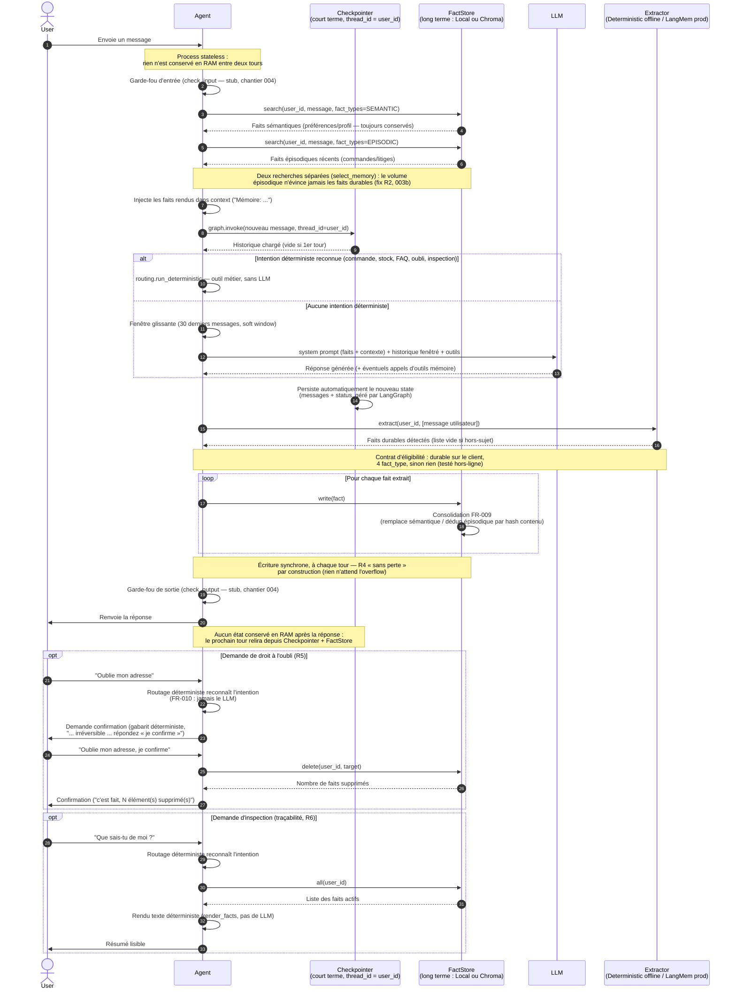

# Chantier 003 — Mémoire long terme (FactStore Chroma / local)

> Suite du chantier 002 (mémoire court terme = checkpointer). Ici on construit la
> mémoire **long terme** : faits durables cross-session (R2), isolation stricte
> par utilisateur (R3-faits), droit à l'oubli RGPD (R5), inspection/traçabilité
> (R6). L'ingestion « sans perte » de l'excédent au-delà de 30 messages (R4) et
> l'extraction automatique par LLM (LangMem) sont **différées** à un incrément
> ultérieur (voir §7).

## 1. Intention

Un client de Velmo qui revient plusieurs jours plus tard ne doit rien réexpliquer :
l'agent se souvient de ses faits et préférences durables (pointure, statut pro,
« tutoie-moi », équipe préférée, litige en cours), les rappelle et adapte son
comportement — sans jamais laisser fuiter la mémoire d'un client vers un autre.
Il peut aussi, sur demande, **oublier** une information (effacement effectif et
vérifiable) et **montrer** ce qu'il a retenu.

## 2. Modèle mémoire — un `FactStore`, patron `kb_store`

Le chantier 002 a établi le principe : une version locale en RAM pour les tests
hors-ligne et un vrai backend en prod, choisi par variable d'environnement. La
mémoire longue reprend **le patron déjà présent dans `kb_store.py`** (`LocalKB` ↔
`ChromaKB`) plutôt que le `BaseStore` de LangGraph : LangGraph n'a pas de backend
Chroma natif pour son Store, or la spec veut les faits durables **dans Chroma**.
Chroma est une base vectorielle exposée à LangChain comme **VectorStore**, pas
comme `BaseStore` — d'où le choix d'une interface `FactStore` maison à deux
backends.

| | FAQ (existant) | Mémoire longue (003) |
|---|---|---|
| Interface | `search()` | **`FactStore` (`write`/`search`/`all`/`delete`)** |
| Hors-ligne / tests | `LocalKB` (TF-IDF) | **`LocalFactStore`** (dict par `user_id`) |
| Prod | `ChromaKB` (collection `velmo_faq`) | **`ChromaFactStore`** (collection `velmo_memory`) |
| Sélection | présence de `CHROMA_URL` | présence de `CHROMA_URL` |
| Isolation | — | **clé/​filtre `user_id`** |

Isolation R3 : **hors-ligne elle est structurelle** (un dict distinct par
`user_id` dans `LocalFactStore` — un utilisateur ne peut pas atteindre le dict
d'un autre) ; **en prod (Chroma) elle repose sur un filtre métadonnée
`user_id`** systématiquement appliqué. Ce filtre est le seul vrai point de
vigilance de ce choix : il est **centralisé en un seul endroit**
(`ChromaFactStore`) et couvert par un test d'isolation explicite. La FAQ
(`kb_store`, collection `velmo_faq`) n'est pas touchée et vit dans une collection
distincte.

### 2.1 Sémantique vs épisodique — un seul `FactStore`, `fact_type` discriminant

Tous les faits vivent dans le même `FactStore` ; le champ `fact_type` distingue
leur nature et leur règle de conflit (FR-009) :

| `fact_type` | nature | R en conflit de même type |
|---|---|---|
| `preference`, `profile` | **sémantique** — trait unique et mutable (pointure, tutoiement, statut pro) | **remplace** : on garde le plus récent, l'ancien est écarté |
| `order_info`, `dispute` | **épisodique** — événement daté, potentiellement multiple (une commande, un litige) | **ajoute** : chaque entrée est conservée, jamais écrasée |

Justification : écraser un fait épisodique ferait perdre un historique légitime
(un client peut avoir plusieurs commandes ou litiges simultanés) — contraire à R6.
Un trait sémantique, lui, n'a qu'une valeur vraie à la fois : garder deux
pointures contradictoires injecterait du bruit dans le contexte du LLM.

### 2.2 Le modèle `Fact`

Un `Fact` porte : `user_id`, `fact_type`, `key` (l'attribut : `pointure`,
`tutoiement`, `order`…), `content` (texte lisible), `created_at`, `updated_at`,
`source` (`"tool"` en écriture directe / `"extractor"` en prod). Le champ `key`
est nécessaire car un utilisateur a **plusieurs** faits sémantiques distincts
(pointure *et* tutoiement) : le remplacement FR-009 se fait sur le couple
`(fact_type, key)`, pas sur `fact_type` seul. La clé de stockage dérive donc de
`(fact_type, key)` pour un fait sémantique (une valeur → remplacement in place),
et est unique par entrée pour un fait épisodique (accumulation).

## 3. Architecture — modules et branchement

```
src/velmo/memory/
  checkpointer.py   (002, court terme — inchangé)
  facts.py          modèle Fact + helpers (fact_type, render)                 ← NEW
  fact_store.py     FactStore : LocalFactStore / ChromaFactStore + get_fact_store()  ← NEW
  extract.py        interface Extractor + impl déterministe hors-ligne        ← NEW
src/velmo/tools/
  memory_tools.py   remember_fact / forget_user_data / inspect_user_memory    ← NEW
```

- **`facts.py`** — le modèle `Fact` (pydantic) et les helpers purs :
  `Fact.new(...)` (fabrique avec horodatage), `SEMANTIC_TYPES`/`EPISODIC_TYPES`,
  `is_semantic(fact_type)`, `render_facts(facts)`. Aucune dépendance au backend.
- **`fact_store.py`** — l'interface `FactStore` et ses deux backends :
  - méthodes : `write(fact) -> Fact` (applique FR-009 selon `fact_type`),
    `search(user_id, query, fact_types=None, k=5) -> list[Fact]`,
    `all(user_id) -> list[Fact]`, `delete(user_id, target=None) -> int`.
  - `LocalFactStore` : dict `{user_id: {storage_key: Fact}}`, tri par récence,
    zéro dépendance — le backend hors-ligne/test.
  - `ChromaFactStore` : collection Chroma `velmo_memory`, métadonnées
    `{user_id, fact_type, key}`, **filtre `where={"user_id": …}` systématique**,
    suppression par ids. Embedding e5 déjà utilisé par `kb_store`.
  - `get_fact_store()` : `ChromaFactStore` si `CHROMA_URL` (et `chromadb`
    importable), sinon `LocalFactStore` — exactement `get_kb()`.
- **`extract.py`** — une interface `Extractor.extract(messages) -> list[Fact]`.
  Impl **déterministe hors-ligne** : épinglage d'entités par regex/mots-clés
  (n° de commande `O-\d{4}-\d{4}`, « tutoie-moi » → préférence,
  « client pro/revendeur » → profil). L'impl **LangMem/LLM** de prod est différée
  (§7) mais l'interface est posée maintenant pour ne pas la casser plus tard.
- **`memory_tools.py`** — les trois outils métier, fermés sur `store`/`user_id`
  (même discipline d'isolation que les outils commande, cf. `_common.owned_order`).

Branchement dans l'agent (parallèle à `session`/`kb`) :

- `Agent.__init__` reçoit un `store` (défaut `get_fact_store()`), le passe au graphe.
- `agent_graph.answer` gagne une étape de **recherche par tour** : avant l'appel
  LLM, `store.search(user_id, message)` remplit le paramètre `context`
  **déjà existant** (injecté dans le system prompt sous « Mémoire: »). R2 se
  branche donc sur une couture qui existe déjà, sans nouveau nœud.
- Les **intentions mémoire** sont routées dans le **nœud déterministe**
  (`velmo.routing`), comme les opérations de commande (voir §4).
- Option prod (bonus, non requise) : exposer aussi la recherche au LLM via
  `create_retriever_tool` pour des lookups ciblés. La recherche **automatique par
  tour** reste la colonne vertébrale (marche hors-ligne, ne dépend pas du LLM).

## 4. Routage déterministe des intentions mémoire

`OfflineChatModel` ne sait pas appeler d'outils ; et FR-010 exige que la
confirmation d'un oubli soit produite par un **gabarit déterministe, jamais par
le LLM**. Les deux contraintes convergent : les intentions mémoire sont
reconnues par regex dans le nœud déterministe et appellent directement les outils.

- « oublie mon… », « supprime mes données/informations » → `forget_user_data`,
  précédé d'une **demande de confirmation par gabarit** ; l'effacement n'a lieu
  qu'après confirmation explicite (réutilise le mécanisme `_confirm_or_act`).
- « que sais-tu de moi », « quelles infos as-tu sur moi » → `inspect_user_memory`.

Double bénéfice : R5/R6 fonctionnent **à travers le vrai agent, hors-ligne et de
façon déterministe**, et FR-010 est satisfait par construction. La **recherche R2**,
elle, est une étape du graphe exécutée à chaque tour, indépendante du chemin
LLM/déterministe. En prod, les mêmes outils restent également exposés au nœud LLM.

## 5. Exigences couvertes

| Exigence | Couverte en 003 ? | Mécanisme |
|---|---|---|
| R2 — faits durables cross-session | ✅ | `FactStore` persistant + recherche par tour → `context` |
| R3 — isolation des faits | ✅ | dict par `user_id` (offline) / filtre `where={"user_id"}` (Chroma) |
| R4 — résumer/sélectionner sans perte au-delà de 30 msg | ❌ → incrément suivant | ingestion de l'excédent + Chroma épisodique |
| R5 — droit à l'oubli | ✅ | `forget_user_data` → `store.delete`, confirmation gabarit |
| R6 — traçabilité/inspection | ✅ | `inspect_user_memory` → `store.all` |

## 6. Stratégie de test

Principe hérité du 002 : piloter le **vrai agent**, asserter sur le **stocké /
injecté**, jamais sur la réponse de l'écho. Tout tourne sur `LocalFactStore`, sans
Docker, sans Chroma, déterministe.

### 6.1 Réécriture des 3 tests xfail (→ verts)

Les tests actuels (`tests/acceptance/test_memory.py`) appellent l'ancien
`MemoryManager` supprimé et sont marqués `xfail(strict=True)`. Ils sont réécrits
pour piloter l'agent :

- `test_cross_session_persistence` (R2) : un agent enregistre trois faits durables
  (via `remember_fact`) pour un utilisateur ; un **nouvel agent, même user, même
  Store** les retrouve — vérifié soit sur les faits injectés dans le `context`,
  soit sur le contenu du Store. Le retrait du marqueur `xfail` est délibéré.
- `test_isolation_between_customers` (R3) : faits distincts pour U1 et U2 ; la
  recherche/inspection de U2 ne contient **aucun** fait de U1 (dicts disjoints),
  même contenus proches.
- `test_right_to_be_forgotten` (R5) : `remember_fact` → oubli déclenché via
  l'agent (message « oublie… » + confirmation) → le fait a **disparu** du Store et
  ne ressort plus sur les tours suivants.

### 6.2 Tests nouveaux

- `test_inspect_user_memory` (R6) : trois faits enregistrés → l'inspection les
  restitue tous les trois, aucun oubli, aucun fait supprimé inclus.
- **FR-009 sémantique** : deux `preference`/`profile` de même type → seule la plus
  récente subsiste.
- **FR-009 épisodique** : deux `order_info` distincts → les deux subsistent.
- **FR-010** : la demande d'oubli produit d'abord un message de confirmation
  **littéral et stable** (gabarit), et n'efface qu'après confirmation.
- **Isolation via recherche sémantique** : la recherche pour un user ne retourne
  que ses faits, même si un autre user a un fait textuellement très proche.

### 6.3 Le partage court/long terme reste intègre

Les tests existants du chantier 002 (`test_recall_over_30_messages`, isolation
court terme) doivent rester verts : la mémoire longue s'ajoute **à côté** du
checkpointer, elle ne le modifie pas.

## 7. Ce qui est explicitement différé (incrément suivant)

- **R4 « résumer / sélectionner sans perte »** : au-delà de 30 messages, persister
  l'excédent comme souvenir épisodique dans Chroma puis le re-sélectionner
  sémantiquement. C'est la partie la plus lourde et la moins testable hors-ligne ;
  la découpler garde 003 net et livrable.
- **Extraction automatique par LangMem (LLM)** : l'implémentation prod de
  l'interface `Extractor`, qui lit la conversation et en extrait/résume les faits.
  L'interface et l'impl déterministe hors-ligne sont posées en 003 ; l'impl LLM et
  la dépendance `langmem` (extra optionnel) sont ajoutées ensuite.
- **Ingestion asynchrone / non bloquante** : 003 est synchrone (YAGNI).
  L'interface laisse la couture pour un hook background ultérieur.

## 8. Points de vigilance

- **Fournir le Store à l'agent partout.** `Agent` reçoit un `store` comme il reçoit
  `session`/`kb`. `build_default_agent` appelle `get_fact_store()` ; `conftest` passe
  un `LocalFactStore` neuf par test (isolation entre tests, comme `fresh_sqlite_session`).
- **Le filtre `user_id` en Chroma est le point critique R3.** En prod, l'isolation
  ne tient qu'au `where={"user_id": …}` appliqué à chaque recherche/suppression.
  Il est **centralisé dans `ChromaFactStore`** (jamais dupliqué chez l'appelant) et
  couvert par un test d'isolation dédié.
- **Latence de la recherche par tour (SC-007).** La recherche R2 s'exécute à chaque
  tour ; hors-ligne elle est instantanée, en prod elle doit rester sous ~500 ms.
  Le filtre `fact_type` optionnel sert à réduire le bruit (ex. exclure les litiges
  résolus), pas à contourner la latence.
- **Effacement vérifiable (R5).** `forget_user_data` doit non seulement supprimer
  mais permettre de **vérifier l'absence** ; l'oubli global (tous les faits du user)
  est distinct de l'oubli ciblé.
- **Oubli d'une donnée inexistante.** Une demande d'oubli sans cible correspondante
  ne doit pas échouer bruyamment : message neutre, aucun effet de bord.
- **Cycle de vie du backend Chroma en prod.** Collection `velmo_memory` distincte de
  la FAQ (`velmo_faq`) ; client/collection créés paresseusement et réutilisés. Non
  exercé hors-ligne.

## 9. Schéma de séquence

> Reprend le schéma initial de conception, ajusté à ce qui a été réellement
> implémenté (003 + 003b). Trois écarts majeurs par rapport à la version de
> conception :
> 1. **Pas de traitement par seuil/async** : l'extraction tourne **à chaque
>    tour**, sur le message entrant, de façon **synchrone** — pas de lot
>    d'excédent différé (voir le design 003b, §2 : « R4 et auto-extraction sont
>    le même mécanisme »).
> 2. **Pas d'appel explicite à un Embedding Model** côté agent : la recherche
>    hors-ligne (`LocalFactStore`) est lexicale (récence + filtre `fact_type`) ;
>    en prod (`ChromaFactStore`), l'embedding est interne à l'appel Chroma, pas
>    une étape séparée orchestrée par l'agent.
> 3. **L'inspection (R6) ne passe pas par le LLM** : `inspect_user_memory` rend
>    les faits en texte par un formateur déterministe (`render_facts`), routé
>    dans le nœud déterministe — pas de résumé LLM (cohérent avec FR-010 : les
>    intentions mémoire évitent le LLM quand c'est possible).



## 10. Flowchart mémoire (lecture / écriture par tour)

> Reprend le flowchart initial de conception, corrigé pour matcher ce qui a été
> réellement implémenté (003 + 003b). Cinq écarts par rapport au brouillon :
> 1. **Pas d'« extrait épisodique brut »** : R4 extrait des **faits structurés**
>    (`order_info`/`dispute`/`preference`/`profile`) à chaque tour — jamais un
>    chunk brut de conversation stocké tel quel.
> 2. **Pas de seuil « fenêtre > 30 messages »** : l'écriture mémoire tourne à
>    chaque tour, de façon inconditionnelle et synchrone — indépendamment de la
>    taille de la fenêtre (voir design 003b, §2).
> 3. **Aucune purge du checkpoint** (pas de `RemoveMessage`) : le checkpointer
>    garde l'historique complet pour toujours ; seule la fenêtre envoyée au LLM
>    est bornée (*soft window*, `window_messages`).
> 4. **Une seule interface de recherche** (`FactStore.search`), pas deux
>    mécanismes distincts « lecture exacte » vs « similarité » : hors-ligne c'est
>    un tri par récence pour les deux groupes de faits, en prod (Chroma) c'est une
>    requête par embeddings pour les deux ; seul le filtre `fact_types` diffère
>    (sémantique vs épisodique).
> 5. **Ajout du fork déterministe/LLM** (`routing.run_deterministic`), absent du
>    brouillon initial mais réellement la première branche du pipeline : la
>    majorité des tours n'atteignent jamais le LLM.

```mermaid
flowchart TD
    MSG["💬 Message utilisateur"]
    GATE_IN{"🛡️ Garde-fou d'entrée ?<br>(stub, chantier 004)"}
    REFUS_IN["💬 Réponse de refus"]

    subgraph READ["🔍 Lecture mémoire (avant tout traitement)"]
        direction LR
        SEM["🎯 FactStore.search(user_id, message, fact_types=SEMANTIC)<br>LocalFactStore (hors-ligne) / ChromaFactStore (prod)<br>→ jusqu'à k=5 faits sémantiques, triés par récence<br>preference/profile — toujours conservés (R2/R3)"]
        EPI["🔎 FactStore.search(user_id, message, fact_types=EPISODIC)<br>→ jusqu'à k=5 faits épisodiques récents<br>order_info/dispute (R2/R3)"]
    end

    CTX["📝 Faits rendus injectés dans le system prompt<br>(« Mémoire: … »)"]
    HIST["🗄️ Checkpointer LangGraph<br>PostgresSaver (prod, sync) / InMemorySaver (hors-ligne)<br>→ historique de la session, thread_id = user_id<br>(mémoire court terme — R1)"]

    ROUTE{"🔀 Intention déterministe reconnue ?<br>(commande, stock, FAQ, oubli, inspection)"}
    DET["⚙️ Outil métier appelé directement<br>sans LLM"]
    WINDOW["🪟 Fenêtre glissante : 30 derniers messages<br>(soft window — rien n'est purgé du checkpoint)"]
    LLM["🤖 LLM (ReAct, outillé)<br>system prompt (mémoire + contexte) + historique fenêtré"]

    SAVE["🗄️ Checkpointer persiste automatiquement<br>le nouveau state (messages + status) — R1"]

    EXTRACT["🧠 Extractor.extract(user_id, [message])<br>DeterministicExtractor (regex, hors-ligne) /<br>LangMemExtractor (LLM, prod)<br>sélectif : hors-sujet → rien (contrat d'éligibilité)"]
    HASFACTS{"Faits durables détectés ?"}

    subgraph WRITE["✍️ Écriture mémoire (chaque tour, synchrone — R4)"]
        direction TB
        WRITELOOP["🗄️ Pour chaque fait : FactStore.write(fact)"]
        CONSOL["🔁 Consolidation FR-009<br>sémantique : remplace sur (fact_type, key)<br>épisodique : dédup par hash du contenu"]
        WRITELOOP --> CONSOL
    end

    GATE_OUT{"🛡️ Garde-fou de sortie ?<br>(stub, chantier 004)"}
    REFUS_OUT["💬 Réponse de refus"]
    RESP["💬 Réponse agent → utilisateur"]
    FIN(["✅ Fin du tour"])

    MSG --> GATE_IN
    GATE_IN -- "refusé" --> REFUS_IN --> FIN
    GATE_IN -- "ok" --> SEM
    GATE_IN -- "ok" --> EPI
    SEM --> CTX
    EPI --> CTX
    CTX --> HIST --> ROUTE
    ROUTE -- "oui" --> DET
    ROUTE -- "non" --> WINDOW --> LLM
    DET --> SAVE
    LLM --> SAVE
    SAVE --> EXTRACT --> HASFACTS
    HASFACTS -- "non" --> GATE_OUT
    HASFACTS -- "oui" --> WRITELOOP
    CONSOL --> GATE_OUT
    GATE_OUT -- "ok" --> RESP --> FIN
    GATE_OUT -- "refusé" --> REFUS_OUT --> FIN
```


