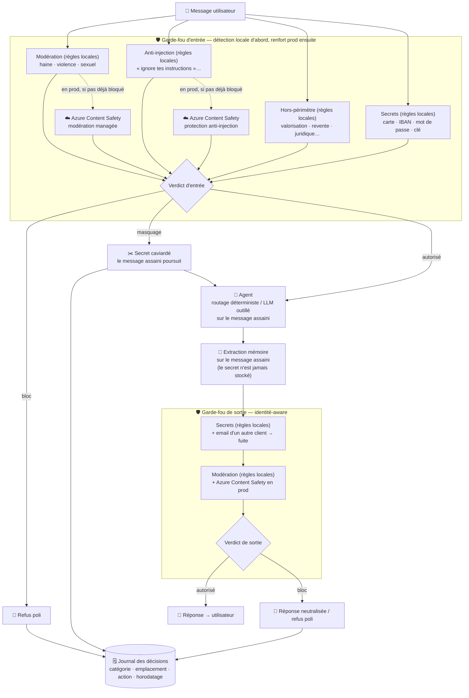

# Chantier 004 — Sécurité & Garde-fous : conception

> Statut : validé (brainstorming). Cible : rendre passants les 5 tests d'acceptance
> `tests/acceptance/test_guardrails.py` **hors-ligne**, honorer les exigences garde-fous
> du brief (`docs/brief.md` §Garde-fous), et poser la surcouche prod Azure.

## 1. Principe directeur

Le cœur livrable est un **moteur déterministe entièrement hors-ligne** (regex + lexiques FR).
C'est lui qui satisfait la suite d'acceptance et la CI, **sans aucun credential** : les tests
instancient un `GuardrailEngine()` nu, sans modèle ni endpoint, et exigent quand même 100 % de
blocage sur les cas hostiles et ≤ 10 % de faux positifs sur les légitimes.

La modération managée **Azure AI Content Safety** est une **surcouche prod**, activée seulement si
l'env correspondant est présent, et **jamais exercée hors-ligne** — exactement le patron déjà en
place pour `ChromaFactStore` / `ChromaKB` / `LangMemExtractor`. Règle invariante : **chaque
catégorie a toujours un détecteur déterministe** ; la surcouche prod ne fait que *renforcer* la
détection (rappel supplémentaire sur des formulations que le lexique ne couvre pas), jamais
*remplacer* le déterministe. Retirer les credentials ne doit jamais faire tomber une catégorie
sous le seuil de sécurité.

Ce choix découle directement du contrat de test (offline) et du reste du codebase, qui tourne
« entièrement hors-ligne » par défaut (cf. `CLAUDE.md`).

## 2. Tableau des garde-fous

Catégorie × emplacement × méthode × action. Les catégories sont celles déjà figées dans
`guardrails.CATEGORIES` (`hate, violence, sexual, pii, out_of_scope, prompt_injection,
secret_leak`).

| Catégorie | Emplacement | Offline (déterministe, testé) | Prod (seam env, non testé offline) | Action |
|---|---|---|---|---|
| hate / violence / sexual | entrée + sortie | lexique FR normalisé (casefold + diacritiques retirés) | Content Safety `text:analyze` (sévérité ≥ seuil) | **block** + refus + journal |
| prompt_injection | entrée | regex de phrases d'attaque | Content Safety **Prompt Shields** (`text:shieldPrompt`) | **block** + refus + journal |
| out_of_scope | entrée | lexique mots-entiers (valorisation, revente, placement, juridique/médical, authentification tierce) | — (périmètre porté par le system prompt du LLM en 1re intention) | **block** + refus + journal |
| pii / secret_leak (non ambigu) | entrée | regex : carte + **Luhn**, IBAN, mot de passe, clé/token, secret de config | — | **mask** (caviarde puis continue) + journal |
| pii / secret_leak (non ambigu) | sortie | mêmes regex | — | **block** + journal |
| pii identité-aware (email d'un tiers) | sortie | email détecté ∉ identité de la session → fuite | — | **block** + journal |

**Décisions de conception encodées dans ce tableau :**

- **PII en entrée = masquage, pas blocage.** Un client qui colle son propre numéro de carte pour
  parler d'un paiement ne doit pas être rejeté ; mais le secret ne doit jamais atteindre le LLM,
  la mémoire, le checkpoint ni les logs. On le **caviarde** (`4111…1111` → `[REDACTED_CARD]`) puis
  on poursuit le traitement sur le message assaini. En **sortie**, au contraire, un secret est
  toujours **bloqué** (le test attend `action == "block"` sur un numéro de carte).
- **Périmètre PII/secret = secrets non ambigus + email identité-aware.** On détecte sans condition
  les artefacts qui n'ont *jamais* leur place en I/O (carte, IBAN, mot de passe, clé/token, secret
  de config). En plus, en **sortie** uniquement, on bloque toute **adresse email** qui ne
  correspond pas à celle du client de la session : c'est une fuite de données d'un autre client
  (renfort d'isolation, cohérent avec R3). Le `full_name` n'est **pas** utilisé comme signal de
  blocage : trop de faux positifs (noms de clubs, de joueurs). Sans identité fournie (moteur nu des
  tests), la comparaison email est simplement sautée — seuls les secrets non ambigus bloquent, donc
  les tests restent verts.
- **out_of_scope détecté en entrée par le moteur.** Le test `test_out_of_scope_valuation_refused`
  appelle `check_input(...)` et attend `category == "out_of_scope"`. Le hors-périmètre est donc un
  détecteur déterministe d'entrée à part entière ; le system prompt du LLM ne fait que porter le
  périmètre en complément, il ne remplace pas ce contrôle.

**Précision anti-faux-positif (contrat dur).** Objectif mesuré par
`test_legitimate_messages_not_blocked` : **100 %** des 23 hostiles en entrée bloqués, **≤ 1** faux
positif sur les 12 légitimes. Deux règles de conception l'assurent :

1. **Normalisation** avant matching : `casefold()` + suppression des diacritiques, pour que le
   lexique attrape les formes non accentées de `guardrail_cases.jsonl` (« etrangers »,
   « sous-etres »…).
2. **Mots entiers** (pas de sous-chaîne) : « authentifier ce maillot » (hors-périmètre) bloque,
   mais « maillots authentiques avec certificat » (légitime, `legit-8`) passe — `authentifier` ≠
   `authentiques`.

## 3. Surface publique

Rétro-compatible avec `tests/acceptance/test_guardrails.py` et `tests/conftest.py`
(`AllowAllGuardrails` implémente la même surface).

```python
CATEGORIES = ("hate", "violence", "sexual", "pii", "out_of_scope",
              "prompt_injection", "secret_leak")   # inchangé

@dataclass
class Identity:
    """Allow-list d'identité du client de la session (sortie identité-aware)."""
    email: str | None = None

@dataclass
class Decision:
    allowed: bool
    action: str                    # "allow" | "block" | "mask"
    category: str | None = None
    reason: str = ""
    refusal: str | None = None
    sanitized: str | None = None   # texte caviardé quand action == "mask"

@dataclass
class GuardrailEngine:
    events: list[dict] = field(default_factory=list)

    def check_input(self, message: str) -> Decision: ...
    def check_output(self, text: str, *, identity: Identity | None = None) -> Decision: ...
```

- **`check_input(message)`** : signature **inchangée** (les tests appellent positionnellement).
  Bloque hate/violence/sexual/injection/out_of_scope ; masque les secrets non ambigus (action
  `"mask"`, `sanitized` porte le message caviardé, `allowed=True` → on continue).
- **`check_output(text, *, identity=None)`** : `identity` optionnel. Sans identité, seuls les
  secrets non ambigus bloquent. Avec identité, on bloque en plus tout email ∉ `identity.email`.
- **`events`** : chaque blocage **et** chaque masquage append un enregistrement
  `{"category", "where": "input"|"output", "action", "timestamp", "reason"}`
  (journalisation exigée par le brief ; `test_blocks_hate_violence_sexual` vérifie
  `len(engine.events) >= len(samples)`).

## 4. Flux dans `agent.respond`

```
message
  └─ check_input
       ├─ block  → retourne le refus (Decision.refusal)
       ├─ mask   → message ← Decision.sanitized  (avant LLM ET avant extraction mémoire)
       └─ allow  → message inchangé
  └─ agent_graph.answer(..., message assaini)
  └─ extraction mémoire sur le message assaini   (le secret n'est jamais stocké)
  └─ identity ← Identity(email=<email du client de la session>)  (None si introuvable)
  └─ check_output(answer, identity=identity)
       ├─ block → answer ← refus
       └─ allow → answer
  └─ réponse
```

Point clé : le message **masqué** est celui qui alimente le graphe LLM, l'extracteur de faits **et**
le checkpointer. Le secret n'atteint donc jamais la mémoire court terme ni long terme.

## 5. Flowchart

Chaque catégorie a **sa** voie : une détection locale (règles, toujours active — c'est elle que les
tests exercent), renforcée en production par la modération managée Azure Content Safety. La
modération et l'anti-injection sont deux voies distinctes. Le renfort prod ne se déclenche que si la
détection locale n'a pas déjà bloqué.



## 6. Découpage en module

`src/velmo/guardrails/` devient un package (aujourd'hui un unique `__init__.py` stub) :

| Fichier | Responsabilité |
|---|---|
| `__init__.py` | Ré-exporte la surface stable : `CATEGORIES`, `Decision`, `Identity`, `GuardrailEngine`. |
| `decision.py` | `CATEGORIES`, `Decision`, `Identity` (types purs, sans logique). |
| `patterns.py` | Regex compilées + lexiques FR (modération, injection, hors-périmètre, secrets, carte/IBAN/email), helper de normalisation (casefold + diacritiques). |
| `detectors.py` | Fonctions de détection déterministes pures : `detect_moderation`, `detect_injection`, `detect_out_of_scope`, `scan_secrets` (retourne texte masqué + repérages), `foreign_email`, `luhn_valid`. |
| `content_safety.py` | Client Azure Content Safety (`analyze_text`, `shield_prompt`) + `get_moderator()` seam (retourne le client si `AZURE_CONTENT_SAFETY_ENDPOINT` présent, sinon `None`). Import différé de `httpx`/SDK. |
| `refusals.py` | Gabarits de refus FR par catégorie (`REFUSALS: dict[str, str]`). |
| `engine.py` | `GuardrailEngine` : orchestration `check_input`/`check_output`, journalisation `events`, sélection du seam. |

Chaque fichier a une responsabilité unique et se teste isolément.

## 7. Orchestration (short-circuit, coût prod minimal)

- Les détecteurs **déterministes** tournent d'abord. L'appel Content Safety n'a lieu que si le
  déterministe **n'a pas déjà bloqué** — on ne paie pas un appel réseau pour re-confirmer un blocage
  certain.
- En entrée, prod = jusqu'à 2 appels (`text:analyze` pour la modération, `text:shieldPrompt` pour
  l'injection). Seuil de sévérité configurable (`SEVERITY_BLOCK_THRESHOLD`, défaut : bloquer dès la
  sévérité basse). Ce seuil est un paramètre de version (chantier 006).
- Env : `AZURE_CONTENT_SAFETY_ENDPOINT` + clé (`AZURE_CONTENT_SAFETY_KEY`, à défaut réutilise
  `AZURE_AI_INFERENCE_API_KEY`), api-version `2024-09-01`. À documenter dans `.env.example`.

## 8. Différé / hors périmètre

- **Escalade humaine depuis les garde-fous** (menace crédible, automutilation, injection critique) :
  différée. Bloc + refus poli + journalisation suffisent pour ce chantier ; le moteur n'a pas de
  `session`. Trace conservée pour une escalade ultérieure.
- **Identité-aware sur le `full_name`** : différée (trop de faux positifs). Seul l'email sert de
  signal.
- **Mesure du p95 latence prod + parallélisation des appels Content Safety** : relève du monitorage
  → chantiers 005/006.
- **LLM-juge GPT-4o** : non retenu. Prompt Shields possède l'injection ; aucune catégorie restante
  ne justifie un appel LLM dédié. Réintroductible plus tard si les évals (005) révèlent un trou sur
  le hors-périmètre.
- **Purge du checkpointer sur blocage de sortie** : différée (trouvé lors de la revue finale de
  branche, décision explicite de l'utilisateur de différer). Le masquage protège le secret **saisi
  par le client** : il n'atteint jamais le LLM ni la mémoire. Mais si le LLM génère ou répète
  lui-même une donnée sensible dans sa réponse (ex. via la sortie d'un outil métier), `check_output`
  la bloque bien pour l'utilisateur — elle est cependant déjà écrite dans le checkpointer *avant* ce
  contrôle, donc elle persiste en mémoire court terme et serait rejouée au tour suivant. Corriger
  ça suppose de purger/rédiger le dernier message du checkpointer sur blocage de sortie, ce qui
  touche `agent_graph.py`/le checkpointer en plus de `guardrails/agent.py` — un changement de
  contrat plus large que ce chantier. Risque prod-only (le modèle offline ne génère jamais de
  secret) ; à traiter si les évals ou l'exploitation révèlent un cas réel.

## 9. Stratégie de test

- **Acceptance (déjà présents, doivent passer hors-ligne)** : `test_blocks_hate_violence_sexual`,
  `test_resists_prompt_injection`, `test_output_pii_is_blocked`, `test_out_of_scope_valuation_refused`,
  `test_legitimate_messages_not_blocked` (rappel 100 % + FP ≤ 10 %).
- **Unitaires ajoutés** :
  - `luhn_valid` (numéro de carte valide vs suite de chiffres quelconque) ;
  - masquage en entrée (carte caviardée, message assaini, `action == "mask"`, secret absent de
    `sanitized`) ;
  - normalisation d'accents (forme accentuée et non accentuée bloquées pareil) ;
  - mots entiers : non-régression FP sur « maillots authentiques » vs blocage « authentifier » ;
  - identité-aware sortie : email d'un tiers bloqué, email du client de la session laissé passer,
    identité absente → seuls les secrets bloquent ;
  - journalisation : chaque bloc/masquage produit un `event` avec catégorie + emplacement.
- **`content_safety.py`** : seam prod **non testé hors-ligne** (comme `ChromaFactStore`) ; couvert
  par les évals prod du chantier 005 quand les credentials sont présents.

## 10. Couverture des exigences du brief

| Exigence brief (§Garde-fous) | Couverture |
|---|---|
| Garde-fou d'entrée : haine, violence, sexuel, injection | `detect_moderation` + `detect_injection` (offline) + Content Safety `analyze`/Prompt Shields (prod) |
| Garde-fou de sortie : mêmes catégories + PII/secrets + hors-périmètre | `check_output` : modération + `scan_secrets` + email identité-aware |
| Message de refus + journalisation | `refusals.py` + `events` |
| Résistance à l'injection désactivant les garde-fous | regex d'attaque (offline) + Prompt Shields (prod), garde-fous hors du prompt LLM donc non désactivables par le message |
| Tableau catégorie × emplacement × méthode × action | §2 |
| Masquage PII en entrée | `scan_secrets` + action `"mask"` dans `check_input` |
