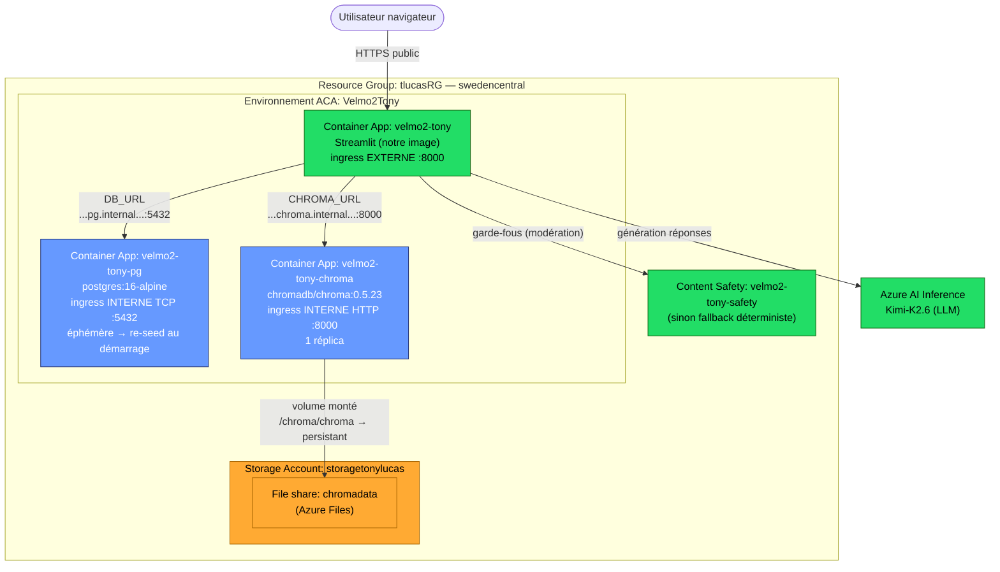

# Chantier 005b — CI/CD trunk-based & déploiement ACA — conception

> Statut : validé (brainstorming). Deuxième des quatre sous-chantiers du volet
> Évaluation & MLOps. Deux couches : un **cœur CI** (label→gate, invalidation,
> tag→release) qui ne dépend d'aucun cloud, et une **couche déploiement Azure
> Container Apps détachable** (tag→build→déploie→révision, rollback natif).

## 1. Objectif et périmètre

Orchestrer la livraison autour du cœur d'évaluation déjà livré en 005a
(`python -m velmo.mlops.score --min-score`, mergé dans `main`) et déployer la démo
Streamlit sur Azure Container Apps (ACA) comme « prod » réelle.

Principe structurant : **la couche déploiement est détachable.** Si l'infra Azure
échoue (abonnement bridé, cf. §3), on supprime le seul fichier `deploy.yml` et le
cœur CI reste 100 % fonctionnel, sans cloud. « Si ça ne marche pas, on ne déploie
pas » est un chemin de sortie *par conception*, pas un échec.

Hors périmètre : Langfuse et le projet prod dédié (→ 005c), RAGAS (→ 005d), la vraie
persistance Postgres (bloquée sur cet abonnement, cf. §3), OIDC (durcissement ultérieur).

## 2. Architecture — deux couches

### 2a. Cœur CI (aucun cloud requis) — GitHub Actions

- **PR + label `ready-for-eval`** → exécute le **gate d'éval offline** de 005a
  (`python -m velmo.mlops.score --min-score $EVAL_MIN_SCORE`, défaut `0.8`). C'est le
  **check obligatoire au merge**.
- **Nouveau commit sur la PR (`synchronize`)** → un job **retire le label**
  `ready-for-eval` (permission `pull-requests: write`). Le check redevient manquant →
  PR non mergeable → il faut reposer le label pour rejouer l'éval sur le code à jour.
- **`push` sur `main`** → garde le gate actuel (filet post-merge ; déjà en place via
  `quality.yml` de 005a).
- **`push` d'un tag `v*.*.*`** → rejoue le gate, puis crée une **GitHub Release** dont
  le corps porte les scores versionnés (note mémoire, blocage, faux positifs, qualité,
  note globale, latence, coût) et attache `mlops/report.md` en asset. La Release est le
  **record versionné immuable** (une par version) — c'est le « une ligne par version »
  du brief, sous forme native Git, sans push-to-`main` fragile.

Le gate CI reste **offline et déterministe** : agent hors-ligne (`build_offline_agent`
de 005a), aucun secret, aucune dépendance réseau. La vraie stack Azure + Content Safety
n'est **pas** rejouée en CI.

### 2b. Couche déploiement ACA (détachable) — `deploy.yml`

Sur `push` d'un tag `v*.*.*`, **après** le gate vert :
1. Build de l'image Docker de la démo, push vers un **Azure Container Registry** (ACR).
2. `az containerapp update -n velmo2-tony --image <acr>/velmo:<tag>` → **nouvelle
   révision** de la Container App.
3. **Rollback** = réactiver la révision précédente :
   `az containerapp revision set-active -n velmo2-tony --revision <précédente>`.
   Instantané, natif, sans rebuild.

Auth GitHub → Azure : **secret de service principal** (`AZURE_CREDENTIALS`, JSON
`az ad sp create-for-rbac --sdk-auth`) consommé par `azure/login`. OIDC fédéré est un
durcissement différé. Isolé dans `deploy.yml` : supprimer ce fichier = revenir au cœur
CI seul.

## 3. Topologie Azure (hybride, adaptée à l'abonnement bridé)

L'abonnement `REMOTE_WCS_211537_DEV IA` **interdit** le fournisseur
`Microsoft.DBforPostgreSQL` (pas de base managée) ; `Microsoft.App`,
`Microsoft.Storage` et `Microsoft.CognitiveServices` (Content Safety, vérifié) sont
disponibles. Postgres et Chroma tournent donc en **Container Apps**. Or Azure Files
(SMB) ne fournit pas le verrouillage de fichiers fiable dont Postgres a besoin (Chroma
en une seule instance le tolère). D'où une persistance **hybride** :

| Composant | Rôle | Hébergement | Persistance |
|---|---|---|---|
| **App** `velmo2-tony` | démo Streamlit | Container App, ingress **externe** :8000 | stateless |
| **Postgres** `velmo2-tony-pg` | catalogue/clients/commandes | Container App `postgres:16-alpine`, ingress **interne** TCP :5432 | **éphémère → re-seed au démarrage** (données de seed déterministes, rien de perdu) |
| **Chroma** `velmo2-tony-chroma` | `velmo_memory` + `velmo_faq` | Container App `chromadb/chroma:0.5.23`, ingress **interne** HTTP :8000, 1 réplica | **persistant** via Azure Files `chromadata` (là où la mémoire long terme R2/R4 a de la valeur) |
| **Content Safety** (existante) | garde-fous prod (modération entrée) | ressource Azure AI **déjà provisionnée** (`eagwu-0283-resource`, partagée avec Kimi) — **réutilisée**, pas recréée | — |
| **Storage** `storagetonylucas` | file share `chromadata` | Storage Account (LRS) | héberge le volume Chroma |

Tout dans le RG `tlucasRG`, l'environnement ACA `Velmo2Tony`, région `swedencentral`.
Networking interne ACA : l'app joint Postgres et Chroma par le DNS interne de
l'environnement (`<app>.internal.<defaultDomain>`), jamais exposés publiquement.

**Content Safety** : **rien à créer** — l'utilisateur dispose déjà d'une ressource Azure AI
(`eagwu-0283-resource`, celle qui sert aussi Kimi) avec son endpoint et sa clé dans `.env`
(`AZURE_CONTENT_SAFETY_ENDPOINT` / `AZURE_CONTENT_SAFETY_KEY`). On les **réutilise** tels quels
(secrets GitHub + env de l'app). Le moteur reste **résilient** : si ces variables sont absentes,
les garde-fous se rabattent sur la détection déterministe locale (déjà géré par
`guardrails/content_safety.py`).

### 3a. Schéma



## 4. Câblage runtime (variables d'env de l'app)

Injectées via `az containerapp update` (secrets pour le sensible, env-vars pour le reste) :

- `DB_URL=postgresql+psycopg://app:<pgpass>@velmo2-tony-pg.internal.<domain>:5432/velmo`
- `CHROMA_URL=http://velmo2-tony-chroma.internal.<domain>:8000`
- `AZURE_AI_INFERENCE_ENDPOINT`, `AZURE_AI_INFERENCE_API_KEY` (secret), `AZURE_AI_INFERENCE_MODEL`
- `AZURE_CONTENT_SAFETY_ENDPOINT`, `AZURE_CONTENT_SAFETY_KEY` (secret) — réutilisés depuis `.env`
- `HF_HUB_OFFLINE=1`, `TRANSFORMERS_OFFLINE=1` (embeddings depuis le modèle **baké dans
  l'image**, cf. §5) — jamais de contact HuggingFace au runtime.

`<domain>` = `az containerapp env show -g tlucasRG -n Velmo2Tony --query properties.defaultDomain -o tsv`.

## 5. Changements de code (déployabilité)

- **`Dockerfile`** : aujourd'hui il installe `uv sync --no-dev` et lance `velmo.cli`.
  Le remplacer par une image qui :
  - installe les extras : `uv sync --extra demo --extra llm --extra vector` ;
  - copie aussi `alembic/`, `alembic.ini`, `scripts/`, `kb/` (nécessaires au seed) ;
  - **bake le modèle e5 au build** :
    `RUN uv run python -c "from sentence_transformers import SentenceTransformer; SentenceTransformer('intfloat/multilingual-e5-small')"`
    (nécessite HuggingFace joignable **pendant le build** — one-shot ; le runtime est
    ensuite offline) ;
  - `ENTRYPOINT` = script de démarrage (ci-dessous) ; `EXPOSE 8000`.
- **Script de démarrage** `scripts/serve.sh` (nouveau) : attend Postgres, joue
  `alembic upgrade head`, (re)seed déterministe Postgres, seed FAQ Chroma **si
  `velmo_faq` est vide**, puis lance
  `streamlit run src/velmo/demo_app.py --server.port 8000 --server.address 0.0.0.0 --server.fileWatcherType none`.
- **`scripts/seed.py`** : rendre le seed **idempotent / reset-safe** (rejoué à chaque
  démarrage du conteneur Postgres éphémère sans planter sur doublons).
- **`scripts/seed_kb.py`** : incohérence à corriger — il lit `CHROMA_HOST`/`CHROMA_PORT`
  alors que le reste du code lit `CHROMA_URL`. L'aligner sur `CHROMA_URL` (via
  `urlparse`, comme `kb_store`/`fact_store`) pour un câblage unique.
- **`docker-compose.yml`** : la cible dev peut réutiliser le nouveau `serve.sh` (optionnel,
  cohérence dev/prod).

## 6. Runbook — qui fait quoi, quand

### Phase 0 — TOI, provisioning (Azure Cloud Shell, `bash`, `az` déjà authentifié)

Déjà fait : app `velmo2-tony` (2 Gio), env `Velmo2Tony`, storage `storagetonylucas`.
Reste (je fournirai le bloc exact au moment de l'implémentation ; forme) :

> À lire d'abord : on ne clique plus dans le portail, on tape des commandes `az`
> (l'outil en ligne de commande d'Azure) dans **Azure Cloud Shell** (le terminal
> intégré au portail, déjà connecté à ton compte). Chaque commande crée ou configure
> une ressource. Les `VARIABLE=valeur` du début évitent de retaper les noms partout.

```bash
# --- Raccourcis : nos noms de ressources, pour ne pas les répéter à chaque ligne ---
RG=tlucasRG            # Resource Group = le "dossier" qui regroupe toutes nos ressources
ENV=Velmo2Tony        # l'environnement Container Apps (le "réseau privé" commun à nos conteneurs)
LOC=swedencentral     # la région Azure (le datacenter) où tout est hébergé
STG=storagetonylucas  # le compte de stockage (le "disque dur externe" persistant)

# === 1. Le disque persistant de Chroma ===
# Récupère la clé d'accès du compte de stockage (comme un mot de passe du disque).
KEY=$(az storage account keys list -g $RG -n $STG --query "[0].value" -o tsv)

# Crée un "dossier persistant" (file share) de 8 Go nommé chromadata sur ce disque.
# C'est là que Chroma écrira la mémoire long terme, pour qu'elle survive aux redémarrages.
az storage share-rm create -g $RG --storage-account $STG -n chromadata --quota 8

# Déclare ce dossier à l'environnement ACA sous le nom "chromastore",
# pour qu'un conteneur puisse le "brancher" ensuite (voir étape 3).
az containerapp env storage set -g $RG -n $ENV --storage-name chromastore \
  --azure-file-account-name $STG --azure-file-account-key "$KEY" \
  --azure-file-share-name chromadata --access-mode ReadWrite

# === 2. La base Postgres (dans un conteneur, éphémère) ===
# Lance l'image officielle postgres:16 comme Container App.
#   --ingress internal + --transport tcp : joignable UNIQUEMENT par nos autres conteneurs
#     (jamais depuis Internet), en TCP sur le port 5432.
#   min/max-replicas 1 : une seule instance (une base = un seul écrivain).
#   --secrets pgpass=... : range le mot de passe de façon chiffrée (remplace <motdepasse>).
#   secretref:pgpass : le conteneur lit le mot de passe depuis ce secret.
# Pas de disque persistant ici : les données (clients, commandes) sont recréées au
# démarrage par notre seed — elles sont déterministes, donc rien n'est perdu.
az containerapp create -g $RG -n velmo2-tony-pg --environment $ENV \
  --image postgres:16-alpine --transport tcp --ingress internal \
  --target-port 5432 --exposed-port 5432 --min-replicas 1 --max-replicas 1 \
  --cpu 0.5 --memory 1.0Gi --secrets pgpass=<motdepasse> \
  --env-vars POSTGRES_USER=app POSTGRES_PASSWORD=secretref:pgpass POSTGRES_DB=velmo

# === 3. Chroma (base vectorielle, avec le disque persistant branché) ===
# Ici on passe par un fichier YAML (chroma-app.yaml, que je fournirai) car "brancher un
# volume" (le dossier chromastore de l'étape 1 sur /chroma/chroma) ne se fait pas en
# options simples. Ingress interne HTTP :8000, joignable seulement par l'app.
az containerapp create -g $RG -n velmo2-tony-chroma --environment $ENV --yaml chroma-app.yaml

# === 4. Content Safety : RIEN À FAIRE ===
# Tu as déjà une ressource Azure AI (eagwu-0283-resource, celle de Kimi) avec son
# endpoint + sa clé dans ton .env (AZURE_CONTENT_SAFETY_ENDPOINT / _KEY). On les
# réutilisera directement — aucune ressource à créer ici.

# === 5. Un "compte robot" pour que GitHub puisse déployer tout seul ===
# Crée un service principal (une identité machine) avec le droit de modifier les
# ressources du groupe. Le JSON renvoyé (--sdk-auth) se colle dans un secret GitHub
# nommé AZURE_CREDENTIALS : c'est ce qui autorise la CI à déployer sans ton mot de passe.
az ad sp create-for-rbac --name velmo2-deployer --role contributor \
  --scopes /subscriptions/<sub>/resourceGroups/$RG --sdk-auth   # -> AZURE_CREDENTIALS
```

Livrable : les valeurs à me transmettre / à mettre en secrets GitHub — endpoints + clés
Kimi et Content Safety (**déjà dans ton `.env`, à recopier en secrets**), `<domain>` (le
suffixe DNS interne de l'environnement), le mot de passe Postgres, et le JSON du service
principal.

### Phase 1 — MOI (code + CI, via le plan d'implémentation)

`Dockerfile`, `serve.sh`, seed idempotent, fix `seed_kb`, workflows `eval` (label→gate,
invalidation) et `deploy.yml` (tag→build→update→révision), doc rollback.

### Phase 2 — TOI, activation (après que le code existe)

1. GitHub → Settings → Secrets : `AZURE_CREDENTIALS`, `ACR_NAME`, `AZURE_AI_INFERENCE_*`,
   `AZURE_CONTENT_SAFETY_*`, `PG_PASSWORD`.
2. Branch protection `main` : rendre le check **Quality gate** obligatoire au merge.
3. Premier déploiement/seed : `az containerapp up --source .` (build + crée l'ACR +
   pousse + met à jour l'app), puis pousser un premier tag `v1.0.0` valide le pipeline.

## 7. Dégradation gracieuse (off-ramp)

- **Content Safety indisponible** (panne, quota) → `AZURE_CONTENT_SAFETY_*` retirés,
  garde-fous déterministes locaux (l'app tourne). *(Le fournisseur n'est pas bloqué sur
  l'abonnement : la ressource est bien créée ; c'est un filet de résilience.)*
- **Chroma sur Azure Files instable** → repli sur Chroma éphémère (perte des faits durables
  au redémarrage, comme Postgres) sans changer le reste.
- **Déploiement Azure abandonné** → supprimer `deploy.yml` ; le cœur CI (§2a) reste entier.
- **HuggingFace down au moment du build** → le bake du modèle échoue ; attendre le retour
  de HF (panne transitoire) ou baker un modèle alternatif. N'affecte pas le cœur CI.

## 8. Stratégie de test

- **Workflows** : validés par `act` en local si possible, sinon par un cycle réel
  (poser le label sur une PR de test → gate ; pousser un commit → label retiré ; pousser
  un tag jetable → Release créée). Pas de test unitaire pour du YAML.
- **`serve.sh` / seed idempotent** : rejouer deux fois le seed sur une SQLite/Postgres
  jetable → aucun doublon, aucune erreur (test ciblé côté `scripts`).
- **Fix `seed_kb` (`CHROMA_URL`)** : test unitaire de parsing d'URL (host/port) comme
  `kb_store`.
- **Image Docker** : `docker build` local réussit et `serve.sh` démarre Streamlit (fumée).
- Le déploiement ACA complet se valide en poussant un tag et en ouvrant l'URL publique.

## 9. Différé

- **005c** : Langfuse (projet prod dédié, 7 signaux, latence p95), alertes de dérive.
- **005d** : RAGAS async.
- Durcissements : OIDC (au lieu du secret SP), vraie persistance Postgres (Azure Files
  NFS premium + vnet, ou base managée sur un abonnement non bridé), scale-to-zero (aujourd'hui
  `minReplicas=1` pour garder les données runtime pendant une session de démo).
