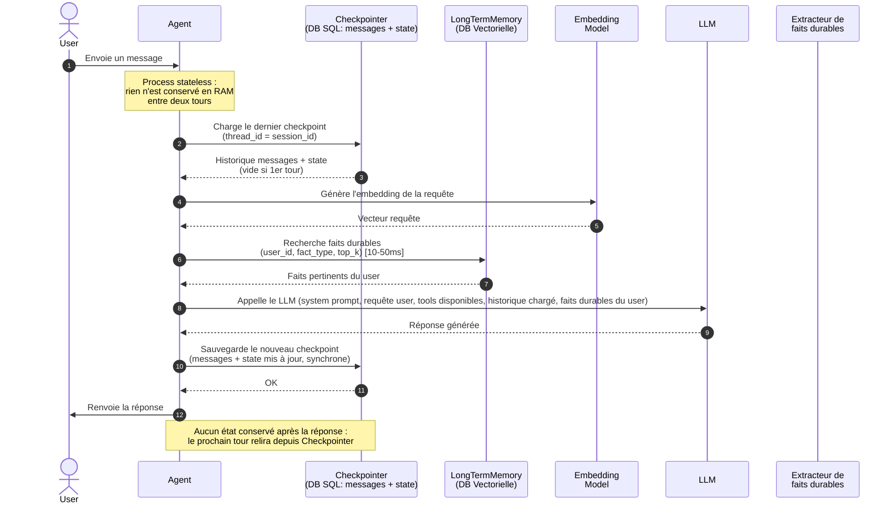

# Spécification : Mémoire court terme de conversation (Chantier 1 — R1 & R4)

**Feature Branch**: `001-short-term-memory`

**Créée le**: 2026-06-30

**Statut**: Brouillon

---

## Clarifications

### Session 2026-06-30

- Q: La gestion du résumé/compression des messages anciens relève-t-elle de la mémoire court terme ? → A: Non — le résumé est géré par la mémoire long terme et indexé dans le RAG. La mémoire court terme se contente de détecter le dépassement du budget et de déclencher le transfert.

### Session 2026-07-01

- Q: Le message utilisateur est-il persisté avant ou après l'appel au LLM ? → A: Avant — de manière synchrone (latence négligeable pour une écriture SQL indexée), afin qu'aucun message reçu ne soit perdu si l'appel au LLM échoue ensuite. La réponse de l'agent est elle aussi persistée de manière synchrone, immédiatement après sa génération et avant d'être renvoyée au client.
- Q: Le déclenchement du transfert des messages excédentaires vers la mémoire long terme (FR-005) doit-il bloquer l'envoi de la réponse à l'utilisateur ? → A: Non — ce traitement est asynchrone et non bloquant : la réponse est renvoyée sans attendre la fin de l'extraction/indexation côté mémoire long terme.
- Q: La spécification doit-elle fixer la représentation technique de l'identifiant de session (ex. un `thread_id` composé) ? → A: Non — la spécification reste agnostique des outils/bibliothèques ; seuls `user_id` et `session_id` sont des identifiants fonctionnels requis (FR-004). Leur éventuelle combinaison technique est un détail d'implémentation, à trancher en phase de planification.
- Q: L'historique est-il rechargé depuis le stockage persistant à chaque tour, ou chargé une seule fois en début de session puis conservé en mémoire du process ? → A: Rechargé systématiquement à chaque tour. Le processus de traitement est stateless : rien n'est conservé en RAM entre deux tours, ce qui rend le service robuste par nature aux redémarrages et compatible avec un déploiement multi-instances sans affinité de session.
- Q: Si l'appel au LLM échoue après la persistance synchrone du message utilisateur (FR-008), que devient ce message ? → A: Il reste persisté tel quel — le tour est incomplet (aucune réponse agent associée), sans rollback ni message d'erreur de substitution. L'historique reflète fidèlement ce qui s'est passé. Note : ce comportement peut être nativement géré par le mécanisme de checkpoint choisi en implémentation ; le détail technique est différé à la planification.
- Q: Le seuil de la fenêtre court terme se compte-t-il en messages ou en tours, et à quelle valeur ? → A: En **messages**, avec un seuil par défaut de **30 messages** (paramétrable). Le budget de tokens est abandonné. La constitution a été mise à jour en ce sens (R1 = tenir 30 tours/messages ; R4 = au-delà de 30 messages, résumer/sélectionner). Il s'agit bien de **30 messages** et non 60 : l'hypothèse antérieure « 30 tours = 60 messages » est caduque et remplacée.

---

## Schéma de séquence

## Scénarios utilisateur & tests d'acceptance *(obligatoire)*

### Scénario 1 — Fil de conversation sur 30+ tours (Priorité : P1)

Un client de Velmo contacte le support et communique une information importante dès le début de
l'échange (par exemple : sa pointure, son numéro de commande, sa préférence de tutoiement). Il
continue d'échanger avec l'agent pendant 30 tours ou plus. À tout moment, si l'agent a besoin de
cette information ou si le client la redemande, l'agent la restitue fidèlement sans que le client
ait à la répéter.

**Pourquoi P1** : C'est l'exigence fondamentale R1 imposée par l'expert. Un agent qui oublie ce
qu'on lui a dit au tour 1 lors du tour 15 est inutilisable et frustrant pour les clients
passionnés de Velmo.

**Test indépendant** : Peut être testé en rejouant une conversation scénarisée de 32 tours et en
interrogeant l'agent sur l'information donnée au tour 1.

**Scénarios d'acceptance** :

1. **Étant donné** une conversation où le client communique sa pointure au tour 1,
   **Quand** l'agent en a besoin au tour 31 (ex. : pour vérifier une disponibilité),
   **Alors** il cite correctement la pointure sans demander au client de la répéter.

2. **Étant donné** une conversation de 35 tours,
   **Quand** on interroge l'agent sur n'importe quelle information donnée aux 5 premiers tours,
   **Alors** il la restitue correctement dans 100 % des cas.

3. **Étant donné** un fil de 30+ tours comportant plusieurs informations (commande, pointure,
   préférence de contact),
   **Quand** l'agent est interrogé sur chacune d'elles en fin de conversation,
   **Alors** chaque information est restituée sans erreur ni confusion.

---

### Scénario 2 — Persistance après redémarrage (Priorité : P1)

Un client reprend une conversation interrompue (redémarrage du service, déploiement, panne
technique). L'historique de la conversation est intégralement retrouvé et l'agent reprend là où
il s'était arrêté, sans perte d'information.

**Pourquoi P1** : La persistance est un pré-requis à R1 : un historique volatile ne tient pas le
fil de conversation si le service redémarre.

**Test indépendant** : Démarrer une conversation de 5 tours, redémarrer le service, reprendre
la conversation et vérifier que l'agent connaît les 5 tours précédents.

**Scénarios d'acceptance** :

1. **Étant donné** une conversation en cours de 10 tours,
   **Quand** le service est redémarré,
   **Alors** à la reprise, l'agent dispose de l'intégralité des 10 tours précédents.

2. **Étant donné** deux utilisateurs ayant chacun une conversation active,
   **Quand** le service redémarre,
   **Alors** chaque utilisateur retrouve uniquement son propre historique, sans contamination.

---

### Scénario 3 — Déclenchement du transfert vers la mémoire long terme (Priorité : P2)

Lorsqu'une conversation devient très longue et dépasse un seuil de budget défini, la mémoire
court terme détecte le dépassement et déclenche un transfert des messages les plus anciens vers
la mémoire long terme, qui se charge de les résumer et de les indexer dans le RAG. La mémoire
court terme continue avec la fenêtre glissante des messages récents.

**Pourquoi P2** : Exigence R4. La mémoire court terme est responsable de la détection du seuil
et du déclenchement, pas de la compression elle-même (qui est déléguée à la mémoire long terme).

**Test indépendant** : Générer une conversation dépassant le seuil de budget et vérifier que les
messages anciens sont transmis à la mémoire long terme et retirés de la fenêtre active.

**Scénarios d'acceptance** :

1. **Étant donné** une conversation dont l'historique dépasse le budget de contexte défini,
   **Quand** l'agent traite le message suivant,
   **Alors** les messages qui dépassent la fenêtre active sont transmis à la mémoire long terme
   et retirés de la fenêtre court terme.

2. **Étant donné** un dépassement de budget,
   **Quand** le transfert vers la mémoire long terme est déclenché,
   **Alors** la fenêtre active ne contient que les messages récents et le budget n'est plus
   dépassé.

3. **Étant donné** un message légitime de support arrivant après un transfert,
   **Quand** l'agent répond,
   **Alors** sa réponse est cohérente avec la fenêtre active restante (la restitution des faits
   anciens relève de la mémoire long terme, hors périmètre de cette spec).

---

### Cas limites

- Que se passe-t-il si l'historique est vide (première conversation) ?
- Que se passe-t-il si deux requêtes arrivent simultanément dans la même session ?
- Que se passe-t-il si la compression elle-même échoue (service LLM indisponible) ?
- Que se passe-t-il si un tour contient un message très long (texte > budget à lui seul) ?
- Que se passe-t-il si l'appel au LLM échoue après la persistance du message utilisateur ? Le
  message reste persisté, le tour est incomplet, sans rollback ni réponse de substitution (cf.
  Clarifications, Session 2026-07-01).

---

## Exigences fonctionnelles *(obligatoire)*

### Exigences fonctionnelles

- **FR-001** : Le système DOIT conserver dans la fenêtre active les messages d'une conversation
  jusqu'au seuil configurable (défaut : **30 messages**), au-delà duquel les messages les plus
  anciens sont transférés vers la mémoire long terme. L'historique intégral reste par ailleurs
  persisté (cf. FR-002).
- **FR-002** : L'historique de conversation DOIT être persisté durablement : il DOIT survivre
  à un redémarrage du service sans perte d'aucun message.
- **FR-003** : Le système DOIT être capable de restituer toute information communiquée par le
  client à n'importe quel tour de la conversation en cours.
- **FR-004** : Chaque conversation DOIT être identifiée par un identifiant de session unique,
  associé à un identifiant utilisateur, garantissant l'isolation des historiques.
- **FR-005** : Lorsque l'historique dépasse un budget de contexte configurable, le système DOIT
  détecter le dépassement et déclencher automatiquement un transfert des messages excédentaires
  vers la mémoire long terme, de manière asynchrone et non bloquante vis-à-vis de la réponse
  renvoyée à l'utilisateur.
- **FR-006** : Le seuil de déclenchement du transfert DOIT être paramétrable sans modification
  du code.
- **FR-007** : L'historique d'une session NE DOIT jamais être accessible depuis une autre
  session ou un autre utilisateur.
- **FR-008** : Le message utilisateur DOIT être persisté de manière synchrone avant l'appel au
  LLM, afin qu'aucun message reçu ne soit perdu même en cas d'échec de la génération de réponse.
- **FR-009** : La réponse générée par l'agent DOIT être persistée de manière synchrone
  immédiatement après sa génération, avant d'être renvoyée à l'utilisateur.
- **FR-010** : Le traitement d'un tour DOIT être stateless : l'historique de session DOIT être
  rechargé depuis le stockage persistant à chaque tour, sans dépendre d'un état conservé en
  mémoire vive du processus entre deux tours.
- **FR-011** : Si l'appel au LLM échoue après la persistance du message utilisateur, ce message
  DOIT rester persisté sans rollback ; le système NE DOIT PAS générer de réponse de substitution
  à sa place. Le tour reste incomplet jusqu'à la prochaine interaction.

### Entités clés

- **Session de conversation** : identifiant unique de session, identifiant utilisateur, liste
  ordonnée de messages, horodatage de création et de dernière activité.
- **Message** : rôle (utilisateur / agent / système), contenu textuel, horodatage, numéro de
  tour dans la session.

---

## Critères de succès *(obligatoire)*

### Résultats mesurables

- **SC-001** : 100 % des informations factuelles fournies au tour 1 sont restituées correctement
  lors de leur rappel au tour 30 ou au-delà (taux de rappel = 100 % sur la suite de tests
  `memorycases.jsonl`).
- **SC-002** : 0 message perdu après un redémarrage du service — l'historique complet est
  disponible immédiatement à la reprise.
- **SC-003** : Le budget de contexte n'est jamais dépassé en production — 0 erreur de dépassement
  de capacité liée à la longueur de l'historique.
- **SC-004** : L'ajout de l'historique de conversation à la réponse de l'agent ajoute moins de
  500 ms de latence supplémentaire par rapport à un agent sans mémoire.
- **SC-005** : Le déclenchement du transfert vers la mémoire long terme (FR-005) n'ajoute aucune
  latence perceptible à la réponse renvoyée à l'utilisateur (traitement asynchrone, non compté
  dans SC-004).

---

## Hypothèses

- Le seuil de la fenêtre court terme est défini dans la configuration du projet ; la valeur par
  défaut est de **30 messages** (paramétrable) avant déclenchement du transfert vers la mémoire
  long terme. Le budget de tokens est abandonné (cf. constitution R1/R4 mises à jour).
- L'isolation par session (FR-007) est implémentée au niveau du stockage persistant, pas
  uniquement en mémoire vive.
- Lorsque le budget est dépassé, la mémoire court terme déclenche un transfert vers la mémoire
  long terme ; la compression et l'indexation RAG sont entièrement gérées par la mémoire long
  terme (hors périmètre de cette spec).
- La mémoire court terme ne stocke PAS les faits sémantiques durables (pointure permanente,
  équipe préférée) — ceux-ci relèvent de la mémoire long terme (Chantier 1 — R2/R3, spec
  séparée).
- Ce chantier ne couvre pas le droit à l'oubli (R5) ni la traçabilité (R6), qui sont traités
  dans la spec mémoire long terme.
