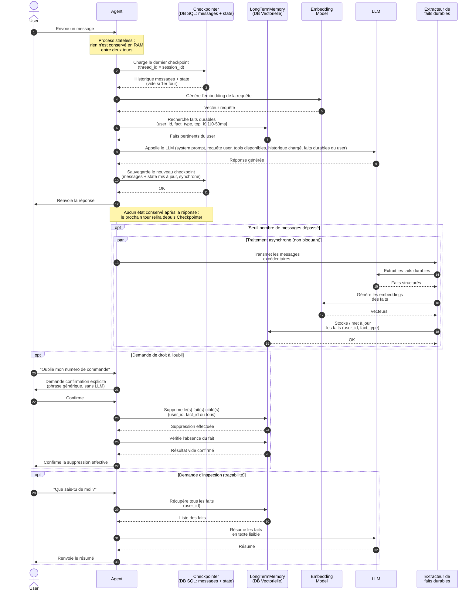
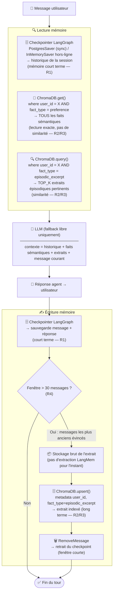

# Spécification : Mémoire long terme, RGPD & Traçabilité (Chantier 1 — R2, R3, R5, R6)

**Feature Branch**: `002-long-term-memory`

**Créée le**: 2026-06-30

**Statut**: Brouillon

**Dépend de** : `specs/001-short-term-memory` (la mémoire court terme déclenche les transferts
vers cette mémoire lors d'un dépassement de budget de contexte)

---

## Clarifications

### Session 2026-07-01

- Q: La confirmation demandée à l'utilisateur avant une suppression (Principe VI) doit-elle être générée par le LLM ou par un gabarit textuel déterministe ? → A: Par un gabarit textuel déterministe, générique, sans passer par le LLM — afin de garantir la fiabilité du message de confirmation et d'éliminer tout risque d'hallucination ou de manipulation par injection de prompt sur une action irréversible.
- Q: La recherche sémantique de faits durables doit-elle pouvoir être restreinte par type de fait, en plus de l'utilisateur ? → A: Oui — la recherche DOIT pouvoir être filtrée par un ou plusieurs `fact_type` (ex. exclure les litiges déjà résolus), en complément systématique du filtre `user_id`.
- Q: La recherche RAG des faits durables est-elle refaite à chaque tour (cohérent avec le choix stateless de la spec 001), ou une seule fois par session ? → A: Refaite à chaque tour, avec le message courant comme requête sémantique. Une recherche gardée en cache pour toute la session est rejetée : si l'utilisateur change de sujet en cours de conversation (ex. passe de sa pointure à un litige), des faits non pertinents resteraient injectés dans le contexte du LLM, créant du bruit hors-sujet. Condition : cette recherche par tour ne DOIT pas ajouter de latence significative (cf. SC-007).
- Q: Comment la distinction mémoire sémantique / mémoire épisodique se reflète-t-elle dans le modèle de données ? → A: Les deux types de mémoire sont stockés dans la même base vectorielle (ChromaDB) ; le champ `fact_type` sert de discriminant. `preference` et `profile` relèvent de la mémoire sémantique (traits durables et généraux sur l'utilisateur — pointure, statut, tutoiement). `order_info` et `dispute` relèvent de la mémoire épisodique (événements datés et potentiellement multiples — une commande, un litige précis).
- Q: La règle de résolution de conflit FR-009 ("garder le plus récent, écarter l'ancien") s'applique-t-elle à tous les `fact_type` ou seulement aux faits sémantiques ? → A: Seulement aux faits sémantiques (`preference`, `profile`), qui représentent un attribut unique et mutable par utilisateur. Les faits épisodiques (`order_info`, `dispute`) sont systématiquement ajoutés comme entrées distinctes, jamais remplacés — un utilisateur peut avoir plusieurs commandes ou litiges actifs simultanément, et l'écrasement ferait perdre un historique légitime (contraire à R6).
- Q: Quel est le seuil qui déclenche le transfert des messages excédentaires vers la mémoire long terme ? → A: Un seuil de **30 messages** (paramétrable), et non un budget de tokens. Le budget de tokens est abandonné (R1 et R4 de la constitution ont été mis à jour en ce sens : R1 = tenir 30 tours/messages, R4 = au-delà de 30 messages, résumer/sélectionner). Il s'agit bien de **30 messages** (et non 60) : l'ancienne équivalence « 30 tours = 60 messages » de la spec 001 est caduque. Ce seuil est la propriété de la mémoire court terme (spec 001) ; la mémoire long terme reste réactive et n'effectue aucun comptage propre.

---

## Schéma de séquence

## Vue simplifiée — implémentation actuelle

Le schéma de séquence ci-dessus décrit la cible. Voici le flux réellement implémenté par
`MemoryManager` (`src/velmo/memory/`), plus simple à lire. Deux écarts notables par rapport à un
schéma « idéal » : la recherche de faits durables se scinde en deux mécanismes distincts (lecture
exacte pour les faits sémantiques, recherche par similarité seulement pour les extraits
épisodiques — cf. `docs/superpowers/specs/2026-07-06-agent-runtime-langgraph-design.md`), et
l'extraction des faits transférés depuis la fenêtre courte n'est pas encore assurée par LangMem :
les messages évincés sont stockés tels quels comme extraits épisodiques.

## Scénarios utilisateur & tests d'acceptance *(obligatoire)*

### Scénario 1 — Retour d'un client entre deux sessions (Priorité : P1)

Un client de Velmo ayant déjà contacté le support revient plusieurs jours plus tard pour une
nouvelle demande. Il a communiqué lors de sessions précédentes des informations durables : sa
pointure, son statut de client professionnel, sa préférence d'être tutoyé. À la reprise, sans
rien répéter, l'agent les rappelle et adapte son comportement en conséquence.

**Pourquoi P1** : C'est le cœur de R2. Un client passionné de Velmo qui doit réexpliquer sa
pointure à chaque session abandonne ou escalade, ce qui détériore l'expérience et augmente la
charge du support humain.

**Test indépendant** : Créer une session S1 pour l'utilisateur U1, enregistrer trois faits
durables, terminer S1, démarrer S2 (nouvelle session, même U1) et vérifier que les trois faits
sont rappelés sans que l'utilisateur les répète.

**Scénarios d'acceptance** :

1. **Étant donné** un utilisateur ayant communiqué sa pointure lors d'une session précédente,
   **Quand** il démarre une nouvelle session,
   **Alors** l'agent connaît sa pointure et ne la lui redemande pas.

2. **Étant donné** un utilisateur revenant après plusieurs jours d'absence,
   **Quand** il reprend contact,
   **Alors** l'agent rappelle ses préférences durables (tutoiement, statut pro, équipe préférée)
   dans 100 % des cas.

3. **Étant donné** un fait durable mis à jour par l'utilisateur (ex. changement de pointure),
   **Quand** il commence une nouvelle session,
   **Alors** c'est la version la plus récente du fait qui est rappelée.

---

### Scénario 2 — Isolation stricte entre utilisateurs (Priorité : P1)

Deux clients différents contactent le support en parallèle ou successivement. Les faits durables
de l'un ne doivent jamais apparaître dans la session de l'autre, même s'ils posent des questions
similaires (même équipe, même commande, même pointure par coïncidence).

**Pourquoi P1** : Exigence R3 — une fuite de données entre clients constitue une violation de
la vie privée et un risque de conformité RGPD grave.

**Test indépendant** : Créer des faits durables pour U1 et U2 (contenus distincts), puis
vérifier qu'une session ouverte pour U2 ne contient aucune information appartenant à U1, et
vice-versa.

**Scénarios d'acceptance** :

1. **Étant donné** deux utilisateurs U1 et U2 avec des faits durables distincts,
   **Quand** U2 interagit avec l'agent,
   **Alors** aucune information appartenant à U1 n'apparaît dans ses réponses.

2. **Étant donné** une requête sémantique sur les faits durables d'un utilisateur,
   **Quand** la recherche est exécutée,
   **Alors** seuls les faits associés à cet utilisateur sont retournés, même si d'autres
   utilisateurs ont des faits textuellement très proches.

---

### Scénario 3 — Ingestion des résumés transmis par la mémoire court terme (Priorité : P1)

Lorsque la mémoire court terme détecte un dépassement de budget (cf. spec 001, Scénario 3),
elle transfère les messages excédentaires à la mémoire long terme. Celle-ci les résume et indexe
les faits durables extraits afin qu'ils soient retrouvables lors des sessions futures.

**Pourquoi P1** : C'est le mécanisme qui assure la continuité entre R1 (court terme) et R2
(long terme). Sans cette ingestion, les faits tombent dans l'oubli après compression.

**Test indépendant** : Déclencher un transfert depuis la mémoire court terme, vérifier que les
faits clés extraits du résumé sont indexés et retrouvables par l'agent lors d'une nouvelle
session.

**Scénarios d'acceptance** :

1. **Étant donné** un transfert de messages excédentaires reçu de la mémoire court terme,
   **Quand** la mémoire long terme le traite,
   **Alors** les faits durables sont extraits, résumés et indexés.

2. **Étant donné** des faits indexés après ingestion d'un résumé,
   **Quand** l'agent démarre une nouvelle session avec le même utilisateur,
   **Alors** ces faits sont disponibles via la recherche sémantique.

---

### Scénario 4 — Droit à l'oubli (R5 — RGPD) (Priorité : P1)

Un client demande à l'agent d'oublier une information spécifique (ex. : « oublie mon numéro de
commande », « supprime mes préférences »). L'agent exécute la suppression effective et vérifiable
de cette information. Lors des échanges suivants, l'information ne réapparaît plus jamais.

**Pourquoi P1** : Exigence légale RGPD (article 17 — droit à l'effacement). Une suppression non
effective ou partielle constitue une non-conformité juridique pour Velmo.

**Test indépendant** : Enregistrer un fait durable, demander sa suppression, puis vérifier sur
les 10 interactions suivantes que l'information n'est jamais restituée par l'agent.

**Scénarios d'acceptance** :

1. **Étant donné** un utilisateur demandant l'oubli d'un fait spécifique,
   **Quand** la demande est traitée,
   **Alors** le fait est supprimé de manière effective et vérifiable dans le stockage persistant.

2. **Étant donné** une suppression effectuée,
   **Quand** l'agent est interrogé sur cette information lors des échanges suivants,
   **Alors** il ne la restitue pas — ni directement, ni par inférence.

3. **Étant donné** une demande d'oubli global (suppression de toute la mémoire d'un utilisateur),
   **Quand** elle est traitée,
   **Alors** l'intégralité des faits durables de cet utilisateur est supprimée et le stockage
   ne contient plus aucune donnée le concernant.

---

### Scénario 5 — Traçabilité : inspection de la mémoire d'un utilisateur (R6) (Priorité : P2)

Un superviseur ou l'utilisateur lui-même demande à voir ce que l'agent a retenu à son sujet.
L'agent restitue un résumé lisible de l'ensemble des faits durables stockés pour cet utilisateur.

**Pourquoi P2** : Exigence R6 (traçabilité) et droit d'accès RGPD (article 15). La traçabilité
est aussi utile pour déboguer des comportements inattendus de l'agent.

**Test indépendant** : Enregistrer trois faits durables pour un utilisateur, déclencher
l'inspection, vérifier que les trois faits sont présents dans le résumé restitué.

**Scénarios d'acceptance** :

1. **Étant donné** un utilisateur demandant à voir ce que l'agent retient de lui,
   **Quand** la demande est traitée,
   **Alors** l'agent restitue un résumé lisible de l'ensemble de ses faits durables stockés.

2. **Étant donné** une inspection déclenchée après une suppression (R5),
   **Quand** le résumé est restitué,
   **Alors** le fait supprimé n'y apparaît plus.

---

### Cas limites

- Que se passe-t-il si deux faits sémantiques contradictoires existent pour le même utilisateur
  (ex. deux pointures différentes enregistrées à deux moments différents) ? → Le plus récent est
  conservé, l'ancien est écarté (FR-009).
- Que se passe-t-il si un utilisateur a plusieurs faits épisodiques du même type (ex. deux
  commandes ou deux litiges distincts) ? → Les deux sont conservés comme entrées distinctes ;
  aucune n'est écrasée par l'autre (FR-009).
- Que se passe-t-il si le stockage persistant est indisponible lors de l'ingestion d'un résumé ?
- Que se passe-t-il si un utilisateur demande d'oublier une information qui n'existe pas ?
- Que se passe-t-il si la recherche sémantique retourne des faits d'un autre utilisateur par
  erreur (défaillance d'isolation) ?
- Que se passe-t-il si l'extraction de faits durables depuis un résumé ne retourne rien
  (message trop court ou sans faits durables) ?

---

## Exigences fonctionnelles *(obligatoire)*

### Exigences fonctionnelles

- **FR-001** : Le système DOIT persister durablement les faits durables d'un utilisateur
  (préférences, statut, informations récurrentes) au-delà de la durée d'une session.
- **FR-002** : Les faits durables DOIVENT être automatiquement disponibles à chaque tour de
  conversation de l'utilisateur, sans intervention manuelle et sans dépendre d'un état conservé
  en mémoire vive entre les tours (traitement stateless, cohérent avec FR-010 de la spec 001).
- **FR-003** : La recherche de faits durables pertinents DOIT être réalisée par similarité
  sémantique par rapport au message courant de l'utilisateur, recalculée à chaque tour, avec un
  filtrage optionnel supplémentaire par type de fait (`fact_type`).
- **FR-004** : Chaque fait durable DOIT être strictement associé à un identifiant utilisateur —
  il ne DOIT jamais être accessible depuis la session d'un autre utilisateur.
- **FR-005** : Le système DOIT recevoir et traiter les messages excédentaires transmis par la
  mémoire court terme, en extraire les faits durables et les indexer.
- **FR-006** : Un utilisateur DOIT pouvoir demander la suppression d'un fait durable spécifique
  ou de l'ensemble de ses données ; la suppression DOIT être effective et vérifiable.
- **FR-007** : Après une suppression (FR-006), le fait supprimé NE DOIT jamais réapparaître
  dans les réponses de l'agent, ni directement ni par inférence.
- **FR-008** : Le système DOIT permettre l'inspection de l'ensemble des faits retenus pour un
  utilisateur donné et en produire un résumé lisible.
- **FR-009** : En cas de conflit entre deux faits **sémantiques** (`preference`, `profile`) de
  même type pour un même utilisateur, le système DOIT conserver la version la plus récente et
  écarter l'ancienne. Cette règle NE s'applique PAS aux faits **épisodiques** (`order_info`,
  `dispute`) : chaque nouvel événement DOIT être conservé comme une entrée distincte, sans
  remplacer les précédentes.
- **FR-010** : Le message de confirmation demandé à l'utilisateur avant une suppression (FR-006)
  DOIT être produit à partir d'un gabarit textuel déterministe et générique — il NE DOIT PAS être
  généré par le LLM, afin de garantir sa fiabilité sur une action irréversible.

### Entités clés

- **Fait durable** : identifiant unique, identifiant utilisateur, type de fait (préférence /
  information de profil / information de commande / autre), contenu textuel, embedding
  sémantique, horodatage de création, horodatage de dernière mise à jour, source (session
  origine / ingestion depuis mémoire court terme). Le type de fait détermine sa nature
  mémorielle : `preference`/`profile` = mémoire **sémantique** (trait durable et général) ;
  `order_info`/`dispute` = mémoire **épisodique** (événement daté, potentiellement récurrent).
- **Profil utilisateur** : identifiant utilisateur, ensemble de faits durables associés,
  horodatage de création, horodatage de dernière activité.
- **Événement de suppression** : identifiant utilisateur, portée (fait unique / tous les faits),
  horodatage de la demande, statut (effectuée / en erreur).

---

## Critères de succès *(obligatoire)*

### Résultats mesurables

- **SC-001** : 100 % des faits durables enregistrés lors d'une session sont disponibles au
  démarrage d'une session ultérieure, indépendamment du délai entre les sessions.
- **SC-002** : 0 fuite inter-utilisateurs — aucune information appartenant à l'utilisateur A
  n'apparaît dans une session de l'utilisateur B, vérifiable sur l'ensemble des cas de test
  d'isolation.
- **SC-003** : Une suppression demandée est effective en moins de 5 secondes ; l'information
  supprimée ne ressort plus dans aucune des 20 interactions de test suivantes.
- **SC-004** : L'inspection de la mémoire restitue 100 % des faits durables actifs d'un
  utilisateur (aucun oubli, aucun fait supprimé inclus).
- **SC-005** : Les faits durables pertinents sont retrouvés par recherche sémantique dans plus
  de 90 % des cas de test où ils sont attendus (taux de rappel sémantique ≥ 90 %).
- **SC-006** : Les faits ingérés depuis la mémoire court terme sont indexés et disponibles en
  moins de 10 secondes après réception du transfert.
- **SC-007** : La recherche sémantique RAG exécutée à chaque tour ajoute moins de 500 ms de
  latence supplémentaire à la réponse de l'agent (seuil harmonisé avec SC-004 de la spec 001).

---

## Hypothèses

- Les faits durables sont stockés dans une base vectorielle isolée par identifiant utilisateur
  via un champ de métadonnée `user_id` ; toute requête filtre systématiquement sur ce champ.
- L'extraction de faits durables depuis un résumé de conversation est réalisée par le LLM
  configuré dans le projet ; si aucun fait durable n'est détecté, aucune écriture n'est
  effectuée.
- La droit à l'oubli (FR-006) s'applique uniquement à la mémoire long terme ; la suppression
  dans la mémoire court terme (PostgreSQL) est traitée dans la spec 001.
- La traçabilité (FR-008) est exposée via un outil de l'agent invocable explicitement par
  l'utilisateur ou un superviseur, pas automatiquement à chaque réponse.
- Un fait durable est considéré « durable » s'il a vocation à rester vrai au-delà d'une session
  (pointure, statut pro, préférence de tutoiement, équipe préférée, litige en cours). Les
  informations contextuelles ponctuelles (numéro de commande d'une session précise) sont
  également stockées si elles ont été mentionnées comme persistantes par l'utilisateur.
- Ce chantier ne couvre pas le fil de conversation court terme ni la gestion du budget de
  contexte (couverts dans la spec 001).
- La suppression RGPD et l'inspection de la mémoire sont implémentées comme outils de l'agent
  (`forget_user_data` et `inspect_user_memory`), invocables sur demande explicite.
