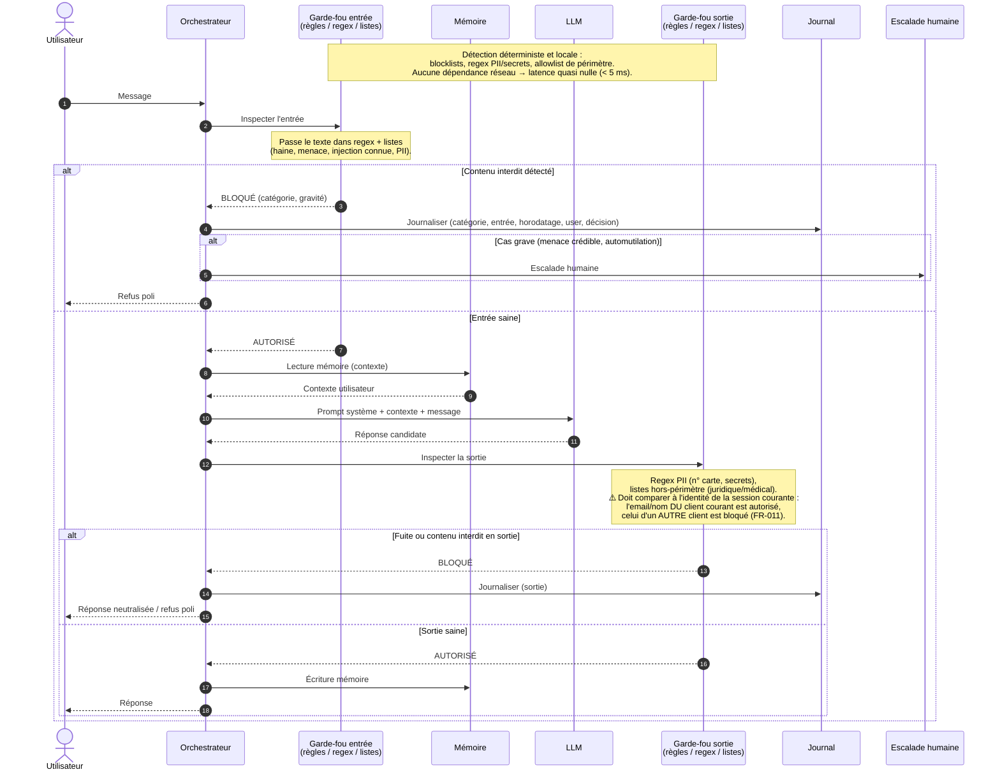
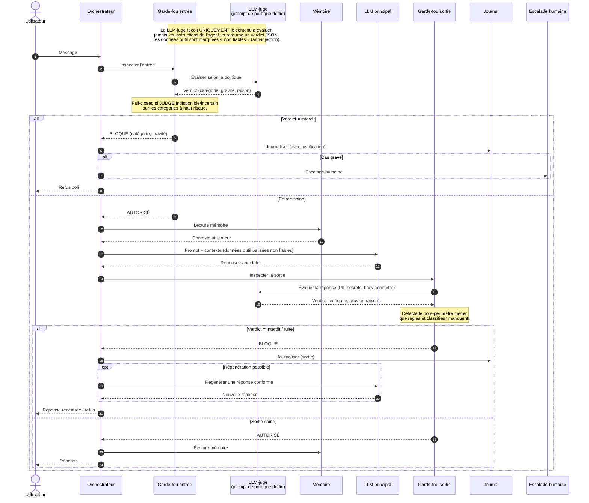
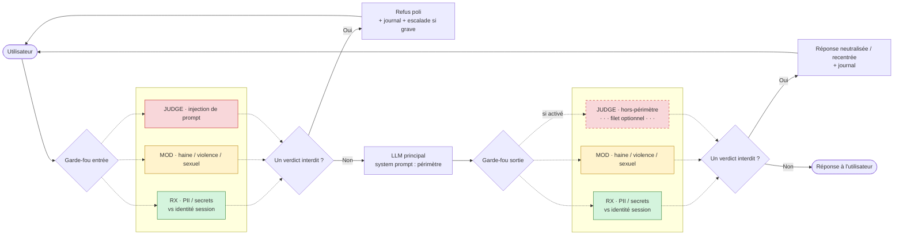

# Solutions de garde-fous — schémas de séquence comparés

**Feature** : `003-guardrails`
**Objet** : présenter 3 approches communément utilisées pour implémenter les garde-fous
d'entrée et de sortie de Velmo 2.0, avec leurs schémas de séquence, leurs compromis et une
recommandation. Une 4ᵉ solution combine ces trois briques par affinité de catégorie
(candidate retenue à date).

Toutes les solutions respectent le pipeline imposé par la constitution (Principe II) :

```
entrée → garde-fou d'entrée → mémoire (lecture) → LLM → garde-fou de sortie → mémoire (écriture) → réponse
```

et couvrent les exigences clés de la spec : blocage entrée **et** sortie (FR-001/002),
journalisation (FR-006), escalade des cas graves (FR-007), et budget de latence < 1 s
au total (SC-007).

Les trois archétypes présentés ci-dessous ne s'excluent pas : ils forment plutôt une gamme
allant du plus léger (règles) au plus intelligent (LLM), et la **recommandation finale** est
une combinaison en couches. Chaque solution est notée individuellement.

---

## Solution 1 — Garde-fous déterministes (règles, regex, listes)

Détection 100 % locale : listes de blocage (mots/patterns interdits), expressions régulières
pour les PII et secrets (n° de carte, clés d'API), listes d'autorisation pour le périmètre.
Aucune dépendance réseau, aucun modèle. C'est le socle historique de la modération.



### Avantages
- **Latence quasi nulle** et coût nul (pas d'appel modèle) → tient le budget SC-007 sans effort.
- **Déterministe et testable** : même entrée → même verdict, idéal pour la CI et le calcul de
  taux de blocage/faux positifs (FR-012).
- **Excellent pour les PII et secrets structurés** (n° de carte, IBAN, clés d'API) : la regex est
  la meilleure méthode pour FR-011/FR-004 en sortie.
- **Configurable par nature** : le comportement n'est pas "bloquer toute PII" mais "bloquer la
  PII qui n'appartient pas au client courant" — la donnée détectée est comparée à l'identité de
  la session (mémoire) avant décision, ce qui évite de bloquer un client donnant son propre email.
- **Fail-closed trivial** : pas de service externe qui peut tomber (couvre le cas limite
  d'indisponibilité).

### Inconvénients
- **Aveugle au sens** : ne comprend ni le contexte, ni le sarcasme, ni la paraphrase. Un message
  haineux reformulé passe au travers (faux négatifs, met SC-001 en péril).
- **Faux positifs élevés** sur le contenu nuancé : « ce maillot est une arnaque » ou « ma carte a
  été débitée deux fois » risquent d'être bloqués à tort (menace SC-004 / Scénario 4).
- **Faible contre les injections de prompt** : ne détecte que les tournures connues, contournable
  par reformulation, encodage (base64), ou multilingue (cas limites de la spec).
- **Maintenance manuelle** permanente des listes.

### Recommandé ?
**Oui, mais jamais seule.** C'est un composant indispensable — surtout pour les PII/secrets en
sortie — mais insuffisant comme unique ligne de défense sur les catégories sémantiques.

### Ce que ça change vs les autres
C'est la brique la plus rapide et la plus fiable pour les motifs **structurés**, mais la plus
faible sur le **sens**. Les solutions 2 et 3 comblent exactement ce trou sémantique.

---

## Solution 2 — Classifieur de modération dédié

Un modèle de classification spécialisé (ex. Llama Guard, un modèle de modération dédié, ou un
classifieur maison) reçoit l'entrée puis la sortie et retourne un verdict par catégorie avec un
score. C'est le standard de l'industrie pour la modération sémantique à grande échelle.

```mermaid
sequenceDiagram
    autonumber
    actor U as Utilisateur
    participant A as Orchestrateur
    participant GE as Garde-fou entrée
    participant MOD as Classifieur de modération<br/>(modèle dédié)
    participant M as Mémoire
    participant LLM as LLM
    participant GS as Garde-fou sortie
    participant J as Journal
    participant H as Escalade humaine

    Note over GE,MOD: Le classifieur renvoie un score par catégorie<br/>(haine, violence, sexuel, injection…).<br/>Décision par seuil ; regex PII conservée en complément.

    U->>A: Message
    A->>GE: Inspecter l'entrée
    GE->>MOD: Classer le message
    MOD-->>GE: Scores par catégorie
    Note over GE: Applique les seuils + regex PII.<br/>Fail-closed si MOD indisponible sur haut risque.
    alt Score > seuil (contenu interdit)
        GE-->>A: BLOQUÉ (catégorie, gravité)
        A->>J: Journaliser
        alt Cas grave (menace, automutilation)
            A->>H: Escalade humaine
        end
        A-->>U: Refus poli
    else Entrée saine
        GE-->>A: AUTORISÉ
        A->>M: Lecture mémoire
        M-->>A: Contexte utilisateur
        A->>LLM: Prompt + contexte
        LLM-->>A: Réponse candidate
        A->>GS: Inspecter la sortie
        GS->>MOD: Classer la réponse
        MOD-->>GS: Scores par catégorie
        Note over GS: Seuils sortie + regex PII/secrets.
        alt Fuite ou contenu interdit
            GS-->>A: BLOQUÉ
            A->>J: Journaliser (sortie)
            A-->>U: Réponse neutralisée / refus
        else Sortie saine
            GS-->>A: AUTORISÉ
            A->>M: Écriture mémoire
            A-->>U: Réponse
        end
    end
```

### Avantages
- **Comprend le sens** : capte les reformulations, le sarcasme léger, le multilingue → bien
  meilleur rappel sur SC-001 que les règles seules.
- **Bon équilibre latence/qualité** : un classifieur dédié est bien plus rapide et moins cher
  qu'un LLM génératif, compatible avec le budget SC-007 (typiquement 50–150 ms).
- **Scores calibrables** : le seuil par catégorie permet d'arbitrer précisément
  sécurité vs faux positifs (SC-004), et de faire du fail-closed sur les catégories à haut risque.
- **Signaux riches pour l'éval** : les scores alimentent directement le chantier 3 (FR-012).

### Inconvénients
- **Dépendance à un service/modèle** : nécessite une politique d'indisponibilité claire
  (fail-open/closed) et gère mal, seul, les **PII structurées** → à compléter par la regex.
- **Coût et latence non nuls** (deux appels par tour : entrée + sortie).
- **Calibrage des seuils** nécessaire et itératif ; risque de dérive si le trafic change.
- **Couverture inégale** des injections de prompt et du **hors-périmètre métier** (juridique,
  engagements Velmo) selon le modèle choisi.

### Recommandé ?
**Oui — c'est la colonne vertébrale recommandée** pour les catégories sémantiques (haine,
violence, sexuel), à condition de garder la regex (Solution 1) pour les PII/secrets.

### Ce que ça change vs les autres
Gagne le sens que la Solution 1 n'a pas, pour une latence bien inférieure à la Solution 3.
En revanche, moins souple que le LLM-juge sur les cas nouveaux ou très contextuels
(périmètre métier, injections créatives).

---

## Solution 3 — Modération par LLM (LLM-as-a-judge)

Un second appel LLM, guidé par un prompt de politique dédié, évalue l'entrée puis la sortie et
rend un verdict structuré (catégorie, gravité, justification). C'est l'approche la plus flexible,
utilisée quand les règles métier sont nuancées (hors-périmètre, engagements de la marque).



### Avantages
- **La plus flexible** : gère les cas nuancés et évolutifs sans réentraînement — hors-périmètre
  (juridique/médical), engagements de Velmo, injections créatives — pilotée par un simple prompt.
- **Verdicts explicables** : la justification renvoyée enrichit la journalisation et l'audit
  (FR-006) et facilite le debug des faux positifs/négatifs.
- **Excellente contre les injections** *si bien conçue* : le juge n'évalue que le contenu, jamais
  les instructions de l'agent, et les données d'outil sont balisées « non fiables » (FR-008/009).
- **Permet la régénération** d'une réponse conforme plutôt qu'un simple refus (cas limite de la spec).

### Inconvénients
- **Latence et coût les plus élevés** : deux appels LLM supplémentaires par tour → risque réel de
  dépasser le budget SC-007 (< 1 s). À réserver aux catégories difficiles.
- **Non-déterministe** : verdicts variables → tests d'éval plus délicats à stabiliser.
- **Le juge est lui-même une cible d'injection** : nécessite un prompt durci et une isolation
  stricte du contenu évalué.
- **Médiocre pour les PII structurées** (surcoût pour ce qu'une regex fait mieux) → garder la Solution 1.

### Recommandé ?
**Oui, mais de façon ciblée** — comme couche complémentaire sur les catégories nuancées
(hors-périmètre, injections), pas comme filtre unique et systématique (latence/coût).

### Ce que ça change vs les autres
Apporte la souplesse et l'explicabilité que ni les règles ni le classifieur n'ont, au prix de la
latence, du coût et du non-déterminisme. C'est le complément « haut de gamme » des deux premières.

---

## Solution 4 ⭐️ — Combinaison ciblée par affinité de catégorie (candidate retenue)

Chaque brique traite uniquement les catégories où elle est la meilleure :
- **Solution 1 (regex/listes)** pour les PII/secrets en entrée **et** sortie (coût et latence
nuls) — comparée à l'identité de la session courante pour n'autoriser que les propres données
du client (pas de faux positif sur son propre email/nom).
- **Solution 2 (classifieur)** pour haine/violence/sexuel en entrée **et** sortie (meilleur
rapport qualité/latence).
- **Solution 3 (LLM-juge)** uniquement pour l'injection de prompt en entrée — seule catégorie
qui exige vraiment un jugement sémantique fin en amont.
- Le **hors-périmètre métier** (juridique, médical, engagement Velmo) est géré en première
intention **dans le system prompt du LLM principal** (consigne de périmètre), pas par un appel
JUDGE dédié — feedback formateur : c'est moins cher, plus rapide, et suffisant si le prompt est
bien testé. Le JUDGE en sortie devient une couche de vérification **optionnelle**, à activer
seulement si les évals du chantier 3 montrent que le system prompt seul laisse passer des cas.
- Les détecteurs actifs d'un même côté sont appelés **en parallèle** pour limiter la latence
cumulée.

```mermaid
sequenceDiagram
    autonumber
    actor U as Utilisateur
    participant A as Orchestrateur
    participant GE as Garde-fou entrée
    participant RX as Regex/listes<br/>(PII, secrets)
    participant MOD as Classifieur<br/>(haine, violence, sexuel)
    participant JUDGE as LLM-juge<br/>(injection en entrée ·<br/>hors-périmètre en filet optionnel)
    participant M as Mémoire
    participant LLM as LLM principal<br/>(system prompt : consignes<br/>de périmètre)
    participant GS as Garde-fou sortie
    participant J as Journal
    participant H as Escalade humaine

    Note over GE,JUDGE: Répartition par affinité :<br/>RX → PII/secrets (entrée+sortie), comparé à l'identité de la session courante<br/>MOD → haine/violence/sexuel (entrée+sortie)<br/>JUDGE → injection (entrée) UNIQUEMENT ; le hors-périmètre est géré en premier<br/>par le system prompt du LLM principal, JUDGE en sortie = filet optionnel.<br/>⚠️ CHECK LATENCE : exécuter les détecteurs actifs EN PARALLÈLE (jamais en série)<br/>et mesurer le p95 réel (entrée + sortie cumulées) contre le budget (< 1 s).

    U->>A: Message
    A->>GE: Inspecter l'entrée
    par Vérifications entrée en parallèle
        GE->>RX: Scanner PII/secrets<br/>(vs identité session)
        RX-->>GE: Verdict Regex
    and
        GE->>MOD: Classer haine/violence/sexuel
        MOD-->>GE: Scores par catégorie
    and
        GE->>JUDGE: Évaluer injection de prompt
        JUDGE-->>GE: Verdict {injection, gravité}
    end
    Note over GE: Agrège les 3 verdicts.<br/>Fail-closed si un détecteur est indisponible<br/>sur une catégorie à haut risque.
    alt Un verdict = interdit
        GE-->>A: BLOQUÉ (catégorie, gravité)
        A->>J: Journaliser (catégorie, entrée, horodatage, user, décision)
        alt Cas grave (menace crédible, automutilation, injection critique)
            A->>H: Escalade humaine
        end
        A-->>U: Refus poli
    else Entrée saine
        GE-->>A: AUTORISÉ
        A->>M: Lecture mémoire (contexte)
        M-->>A: Contexte utilisateur
        A->>LLM: Prompt système (consignes de périmètre)<br/>+ contexte (données outil balisées non fiables)
        LLM-->>A: Réponse candidate
        A->>GS: Inspecter la sortie
        par Vérifications sortie en parallèle
            GS->>RX: Scanner PII/secrets<br/>(vs identité session)
            RX-->>GS: Verdict Regex
        and
            GS->>MOD: Classer haine/violence/sexuel
            MOD-->>GS: Scores par catégorie
        end
        opt Filet de sécurité optionnel<br/>(activé seulement si les évals du chantier 3<br/>montrent que le system prompt laisse passer des cas)
            GS->>JUDGE: Évaluer hors-périmètre<br/>(juridique, médical, engagement Velmo)
            JUDGE-->>GS: Verdict {hors-périmètre, gravité}
        end
        Note over GS: Agrège les verdicts actifs.<br/>⚠️ CHECK LATENCE : additionner le temps entrée + sortie<br/>mesuré en conditions réelles avant mise en production.
        alt Un verdict = interdit / fuite
            GS-->>A: BLOQUÉ
            A->>J: Journaliser (sortie)
            A-->>U: Réponse neutralisée / recentrée / refus poli
        else Sortie saine
            GS-->>A: AUTORISÉ
            A->>M: Écriture mémoire
            A-->>U: Réponse
        end
    end
```

Vue simplifiée du même flux (sans les échanges détaillés ni la journalisation/escalade) :



*Les vérifications actives d'un même côté sont exécutées en parallèle (dispatch simultané, pas
séquentiel), c'est le point à garder en tête pour le check de latence. Le hors-périmètre est
géré en premier par le system prompt du LLM principal ; JUDGE en sortie (pointillés) n'est
qu'un filet de sécurité optionnel.*

### Avantages
- **Chaque catégorie traitée par l'outil le plus adapté** : PII/secrets par regex contextuelle
  (rapide, fiable, fail-closed simple), sémantique courante par classifieur (bon compromis),
  injection par LLM-juge (seule catégorie qui l'exige vraiment en amont).
- **PII sans faux positif évident** : la regex compare la donnée détectée à l'identité de la
  session courante — le client peut donner son propre email/nom sans être bloqué à tort ; seule
  une donnée appartenant à un autre client déclenche le blocage (FR-011).
- **Hors-périmètre traité au bon endroit** : le system prompt du LLM principal porte les
  consignes de périmètre en première intention (pas d'appel modèle supplémentaire) ; le LLM-juge
  n'intervient qu'en filet optionnel si les évals du chantier 3 montrent un besoin.
- **Latence et coût minimisés par construction** : le LLM-juge n'est sollicité systématiquement
  que sur l'injection en entrée (1 catégorie), les autres appels tournent en parallèle.
- **Couverture complète** des catégories de la spec (FR-003/FR-004) sans zone morte.

### Inconvénients
- **Complexité d'orchestration** : plusieurs détecteurs à appeler en parallèle et à agréger, avec
  une politique de fail-closed/fail-open à définir *par détecteur* (FR-013), pas une seule fois.
- **Le check de latence n'est pas automatique** : l'appel parallèle réduit le risque mais ne le
  supprime pas — il faut **mesurer réellement** le p95 cumulé (entrée + sortie) avant mise en
  production. Sans cette mesure, SC-007 (< 1 s) n'est qu'une hypothèse.
- **Le hors-périmètre repose sur le system prompt** : sans filet JUDGE actif par défaut, une
  dérive du LLM principal n'est détectée qu'a posteriori par les évals — à surveiller de près
  au lancement, avant de décider d'activer ou non le filet optionnel en continu.
- **Plusieurs briques à maintenir** (listes regex, comparaison d'identité, seuils du classifieur,
  prompt système de périmètre, prompt du juge) — surface de configuration large pour le
  chantier 3 (calibrage, éval).

### Recommandé ?
**Oui — c'est la solution retenue.** Elle correspond exactement à la synthèse : chaque brique
sur son point fort, la PII vérifiée par rapport à l'identité de la session, et le hors-périmètre
géré nativement dans le system prompt plutôt que par un appel LLM-juge systématique (retour du
formateur). Condition de mise en production : valider le **check de latence** (p95 réel,
entrée+sortie) et confirmer via les évals que le system prompt suffit seul sur le hors-périmètre.

### Ce que ça change vs les autres
Par rapport à S1/S2/S3 prises isolément, c'est la seule option qui satisfait à la fois SC-001/
SC-002 (couverture complète) et SC-007 (budget de latence) sans sacrifier une catégorie. Le
compromis vs une architecture 100 % classifieur ou 100 % LLM-juge est la complexité
d'orchestration (3 briques, agrégation des verdicts) en échange d'un meilleur ratio
performance/coût/couverture.

---

## Synthèse et recommandation

| Critère | S1 · Règles | S2 · Classifieur | S3 · LLM-juge | S4 · Combinaison ciblée |
|---|---|---|---|---|
| Latence | ⭐⭐⭐ (~ms) | ⭐⭐ (~100 ms) | ⭐ (appels LLM) | ⭐⭐ (JUDGE limité à 2 catégories, en parallèle) |
| Coût | Nul | Faible | Élevé | Faible à moyen |
| Compréhension sémantique | Faible | Bonne | Excellente | Bonne à excellente (par catégorie) |
| PII / secrets structurés | Excellente | Moyenne | Faible | Excellente (via RX) |
| Anti-injection | Faible | Moyenne | Bonne (si durci) | Bonne (via JUDGE, ciblé) |
| Hors-périmètre métier | Faible | Moyenne | Excellente | Bonne (system prompt) + filet JUDGE optionnel |
| Faux positifs | Élevés | Maîtrisables | Faibles | Maîtrisables |
| Déterminisme / testabilité | Excellent | Bon | Moyen | Bon |
| Fail-closed simple | Oui | À gérer | À gérer | À gérer par détecteur |

**Recommandation pour Velmo 2.0 : Solution 4 — la combinaison ciblée** (aucune solution seule ne
satisfait toutes les exigences ; S4 assemble S1/S2/S3 par affinité de catégorie) :

1. **Solution 1 (règles/regex)** pour les **PII et secrets** en entrée **et** sortie
   (FR-011) — coût et latence nuls, fail-closed simple, décision **comparée à l'identité de la
   session courante** (la donnée du client lui-même n'est pas bloquée, celle d'un autre client l'est).
2. **Solution 2 (classifieur)** comme **socle sémantique** entrée + sortie (haine, violence,
   sexuel) — meilleur rapport qualité/latence, seuils calibrables pour SC-004.
3. **Solution 3 (LLM-juge)** en **couche ciblée**, uniquement sur l'injection de prompt en
   entrée — pas systématique, pour préserver SC-007.
4. Le **hors-périmètre métier** (FR-004) est géré en première intention par les **consignes de
   périmètre dans le system prompt** du LLM principal (retour du formateur) ; le LLM-juge en
   sortie reste disponible comme **filet de sécurité optionnel**, à activer si les évals du
   chantier 3 montrent que le system prompt seul ne suffit pas.

Cette combinaison couvre 100 % des catégories tout en tenant le budget de latence, et fournit
des signaux exploitables (scores + verdicts + décisions) pour les suites d'évaluation du
chantier 3 (FR-012). Le **check de latence réel (p95, entrée + sortie cumulées)** reste à
valider avant mise en production (cf. Solution 4). Le détail « catégorie × emplacement ×
méthode × action » sera arbitré en `/speckit-plan` (tableau des garde-fous).
