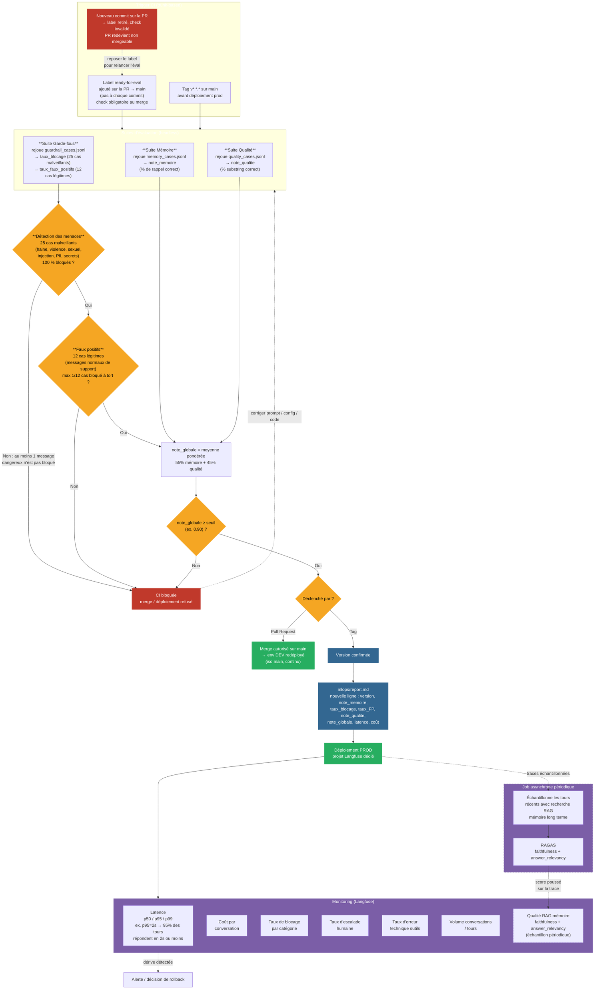

# Boucle qualité — Évaluation & MLOps

**Feature** : `006-evaluation-automatisee`
**Objet** : schéma de la boucle qualité imposée par le brief — suites d'évaluation → CI (seuil
bloquant) → versionnage → signaux de suivi. Ce document fixe les décisions de conception
prises avant l'écriture du spec.md (Principe I de la constitution : conception avant le code).

Rappel du pipeline global dans lequel s'inscrit cette boucle (Principe II) :

```
entrée → garde-fou d'entrée → mémoire (lecture) → LLM → garde-fou de sortie → mémoire (écriture) → réponse
```

La boucle qualité ne s'exécute pas sur ce flux en production : elle rejoue ce même pipeline
**headless**, via `Agent.respond`, contre des jeux de cas figés (`eval/*.jsonl`), à chaque
changement de version.

---

## Comment lire le schéma

Le schéma se lit comme un parcours en 5 temps : **on déclenche → on mesure → on décide → on
archive/déploie → on observe**. Les trois premiers temps se jouent avant la livraison (CI),
les deux derniers après (déploiement).

**1. On déclenche (`TRIGGER`)** — Deux événements Git distincts entrent dans la même
mécanique d'éval, mais n'aboutissent pas à la même chose. Sur une **Pull Request vers `main`**,
l'éval **n'est pas relancée à chaque commit** : elle se déclenche uniquement quand un label
dédié (`ready-for-eval`) est ajouté à la PR, quand l'auteur juge que c'est prêt à être vérifié
— ça évite de rejouer 3 suites (avec de vrais appels LLM) à chaque petit push pendant qu'on
itère encore, tout en restant un **check obligatoire au merge** une fois posé (stratégie
trunk-based : une branche longue `main`, des branches courtes par feature). Un **tag
`v*.*.*` poussé sur `main`** rejoue la même éval sur le commit taggé, juste avant le
déploiement en prod — c'est une seconde vérification indépendante, pas une confiance aveugle
dans le fait que "ça passait déjà en PR".

Point important, symétrique du précédent : un check vert ne doit jamais survivre à un commit
qu'il n'a pas réellement testé. Si un nouveau commit est poussé sur la PR après que le label a
déclenché l'éval, le label est retiré automatiquement et le check redevient invalide — la PR
n'est plus mergeable tant que le label n'est pas reposé et l'éval rejouée sur le nouveau code
(`INVALID -.-> LABEL`). Sans ce mécanisme, un "check vert" pourrait en réalité valider un état
du code qui n'existe plus.

**2. On mesure (`SUITES`)** — Les trois suites tournent en parallèle sur la même version du
code, chacune contre son propre jeu de cas figé. Elles ne communiquent pas entre elles à ce
stade : chacune produit juste sa métrique brute (`note_memoire`, `taux_blocage` +
`taux_faux_positifs`, `note_qualite`). Point important : ce sont des mesures **déterministes**
(comparaison de sous-chaînes, pas de jugement d'un second LLM), donc reproductibles d'un run à
l'autre — condition nécessaire pour qu'un seuil de blocage CI ait du sens sans être bruité.

**3. On décide (`GATE1` → `GATE2` → `AGG` → `GATE3`)** — C'est le cœur de la boucle, et le
point le plus important du schéma : la décision n'est **pas une moyenne unique** dès le
départ. `GATE1` et `GATE2` ne testent que les métriques de la **suite Garde-fous**
(`taux_blocage` puis `taux_faux_positifs`) — Mémoire et Qualité n'y entrent pour rien, elles ne
peuvent donc ni compenser un échec garde-fous, ni en être bloquées. Ce n'est qu'une fois ces
deux verrous garde-fous passés que `note_memoire` et `note_qualite` entrent en jeu, dans
`AGG` : c'est là, juste avant `GATE3`, que les 3 suites se rencontrent pour la première fois,
sous forme d'une moyenne pondérée comparée à un seuil. Cette séparation évite qu'un excellent
score mémoire "rachète" un garde-fou défaillant : la sécurité n'est jamais négociable, la
qualité générale, elle, tolère une marge.

**4. On archive/déploie (`ORIGIN` → `MERGE` / `TAG` → `REPORT` → `PROD`)** — Une fois tous les
gates passés, le chemin diverge selon le déclencheur d'origine. Venant d'une **PR** : le merge
sur `main` est autorisé, et l'environnement **dev** — qui suit `main` en continu — se
redéploie automatiquement. Venant d'un **tag** : la version est confirmée, une nouvelle ligne
est ajoutée à `mlops/report.md`, puis l'environnement **prod** est déployé avec ses propres
secrets et son propre projet Langfuse. Point important : `mlops/report.md` n'est écrit **que**
sur le chemin tag → prod, jamais sur un simple merge — une version "de dev" n'est pas une
version officielle tant qu'elle n'est pas taguée.

**5. On observe (`PROD` → `MONITOR` → `ALERT`)** — Une fois en prod, Langfuse prend le relais
pour surveiller ce que les jeux de test figés ne peuvent pas capturer : usage réel, coût réel,
latence réelle, par 7 signaux précis (détaillés au point 6 des décisions actées). Point
important : cette boucle est **indépendante** de la CI — une dérive détectée ici
(`MONITOR -.-> ALERT`, en pointillés) ne rejoue pas les suites, elle déclenche une alerte
humaine qui peut, séparément, motiver un rollback vers la dernière version consignée dans
`report.md`.

Six de ces sept signaux sont calculés en continu, directement à partir des traces Langfuse. Le
septième (`RAG`, qualité du RAG mémoire long terme) fonctionne différemment : il n'est pas
dérivé passivement des traces, il nécessite un calcul actif par un second LLM (RAGAS,
métriques `faithfulness` et `answer_relevancy`). Comme la Suite Mémoire de la CI reste
volontairement déterministe (point 2, pas de LLM-juge), ce calcul ne peut pas se faire en CI —
il tourne en prod, sur un **échantillon** périodique des tours ayant déclenché une recherche
RAG (`PROD -.-> SAMPLE`, en pointillés comme les autres mécanismes non continus du schéma),
plutôt que sur 100 % du trafic, pour ne pas doubler le coût et la latence LLM de chaque
conversation.

Sur tout le parcours, une seule sortie d'échec (`FAIL`), qu'elle vienne d'une PR ou d'un tag :
retour à la case départ, correction du prompt/config/code, sans jamais toucher à `main` ni à
la prod (`FAIL -.-> SUITES`, en pointillés car c'est un retour en arrière, pas une étape du
flux normal).

---

## Schéma



---

## Décisions actées

### 1. Trois suites, exécutées headless

Chaque suite appelle directement `run_turn` (pas l'API HTTP — cf. ROADMAP.md, contrainte 006) :

- **Mémoire** : rejoue les tours de `memory_cases.jsonl`, pose la `question` d'évaluation
  finale, vérifie que la réponse contient `expected_substring`. `note_memoire` = % de cas
  corrects. Le champ `tag` (R1–R6) permet un sous-score par exigence pour le diagnostic.
- **Garde-fous** : rejoue `guardrail_cases.jsonl` (25 cas malveillants + 12 cas
  `legitimate`), compare l'action réelle à `expected_action` selon `where` (entrée/sortie).
  Produit deux métriques distinctes : `taux_blocage` (sur les cas malveillants) et
  `taux_faux_positifs` (sur les cas légitimes).
- **Qualité** : rejoue `quality_cases.jsonl`, vérifie `expected_substring` dans la réponse.
  `note_qualite` = % de cas corrects.

### 2. Gate en deux temps, pas une moyenne unique

Les garde-fous ne sont pas négociables (Principe IV, SC-001/002/003 de `003-guardrails`) :
**un seul** cas dangereux non bloqué suffit à faire échouer la CI, indépendamment du reste.
Le taux de faux positifs (`≤ 8 %`, soit au plus 1 cas sur 12) est le second verrou dur. Ces
deux métriques garde-fous sont **exclusivement** gérées en pass/fail par `GATE1`/`GATE2` — une
fois passées, elles ne réapparaissent pas dans `note_globale`, pour éviter de les compter deux
fois (une fois en verrou dur, une fois diluées dans une moyenne). `note_globale` ne combine
donc que mémoire et qualité (`55 % / 45 %`), comparée à un seuil global — c'est cette note qui
absorbe le bruit naturel (légère reformulation du LLM) sans jamais masquer un incident de
sécurité.

### 3. Déclencheur CI et stratégie Git : trunk-based, deux événements distincts

Une seule branche longue (`main`), des branches courtes par feature (le pattern `00X-nom` déjà
utilisé pour les specs) — pas de branche `develop` séparée, disproportionné pour un projet
solo. Deux événements déclenchent la même mécanique d'éval, avec un effet différent :

- **Pull Request → `main`, sur label `ready-for-eval`** : pas de réévaluation à chaque commit
  (coûteux et lent avec de vrais appels LLM) — l'auteur pose le label quand il est prêt, ce qui
  déclenche les 3 suites + les gates, comme **check obligatoire au merge**. C'est le sens
  concret de "la CI bloque la livraison" : le label ne dispense pas du contrôle, il en décale
  juste le déclenchement.
- **Invalidation sur nouveau commit** : le label est retiré automatiquement dès qu'un nouveau
  commit arrive sur la PR (`synchronize` côté GitHub) — le check redevient manquant, la PR
  n'est plus mergeable, et il faut reposer le label pour relancer l'éval sur le code à jour.
  Sans ça, une PR pourrait rester "verte" avec un check qui ne correspond plus au code réel.
- **Tag `v*.*.*` poussé sur `main`** : rejoue la même éval sur le commit taggé, juste avant le
  déploiement en prod. On ne fait pas confiance au résultat de la PR seule : le tag revérifie
  sur l'état réel de `main` au moment du tag (qui peut avoir divergé si d'autres merges ont eu
  lieu entre-temps).

### 4. Environnements : dev (iso `main`) et prod (sur tag)

Deux environnements seulement, volontairement léger pour un projet solo :

- **dev** : redéployé automatiquement à chaque merge sur `main` — reflète toujours le dernier
  code passé en CI, sert à explorer/démontrer sans attendre un tag.
- **prod** : mis à jour uniquement quand un tag est poussé et revérifié — secrets et projet
  Langfuse dédiés, séparés de ceux utilisés en dev, pour ne pas polluer les signaux de
  monitoring prod avec du trafic de test.

Le tag reste donc la frontière officielle entre "ça tourne sur `main`" et "c'est une version
livrée" — cohérent avec le point 5.

### 5. Versionnage : tag Git + `mlops/report.md`

Une version de Velmo 2.0 = le triplet (prompt, config mémoire, config garde-fous) figé dans
un commit. Le **tag Git** identifie cette version de façon unique et immuable. La **note**
associée (mémoire, blocage, faux positifs, qualité, globale, latence, coût) est écrite dans
`mlops/report.md` — une ligne par version, uniquement sur le chemin tag → prod (jamais sur un
simple merge dev) — qui reste la source de vérité comparable d'une livraison à l'autre
(exigence explicite du brief et de FR-012 / Principe V).

### 6. Signaux de suivi en exploitation : Langfuse, séparé de la CI

La CI reste headless, déterministe, sans dépendance réseau externe pour décider du pass/fail.
Une fois en production, Langfuse trace les conversations réelles et fournit 7 signaux de
monitorage, chacun avec un rôle distinct :

- **Latence** (p50/p95/p99 par tour) — expérience utilisateur directe.
- **Coût par conversation** (tokens × prix modèle) — comparable au coût mesuré en CI pour
  détecter une dérive (ex. prompt qui a grossi).
- **Taux de blocage garde-fous par catégorie** — comparable au `taux_blocage`/`taux_FP` mesuré
  en CI ; un fort écart signale soit une attaque réelle en cours, soit un mauvais calibrage.
- **Taux d'escalade humaine** (`escalateto_human`) — charge sur les humains, signal indirect
  de qualité perçue.
- **Taux d'erreur technique des outils** (`getorder`, `trackshipment`... qui échouent/timeout)
  — distinct d'un blocage métier, signale un problème d'infra plutôt que d'agent.
- **Volume de conversations / tours par session** — contexte nécessaire pour interpréter les
  cinq signaux précédents (un pic de latence à fort trafic n'a pas le même sens qu'à faible
  trafic).
- **Qualité du RAG mémoire long terme** (`faithfulness` + `answer_relevancy`, via RAGAS) — la
  réponse s'appuie-t-elle réellement sur les faits récupérés dans ChromaDB (pas d'invention), et
  répond-elle à la question posée ? Calculé sur un **échantillon périodique** (job async, pas
  100 % du trafic) de tours ayant déclenché une recherche RAG, car ces deux métriques
  nécessitent un second LLM comme juge — un coût et une latence qu'on ne veut faire porter ni à
  chaque conversation, ni à la CI (point 2).

On limite volontairement ce signal à `faithfulness` et `answer_relevancy` : ce sont les deux
métriques RAGAS qui ne nécessitent **pas** de vérité terrain (quels faits étaient réellement
pertinents pour chaque requête), donc calculables directement sur du trafic prod réel sans
travail de labeling préalable. `context_precision` et `context_recall` (qui, eux, en ont
besoin) restent un point ouvert — cf. dernière section — pour un usage ultérieur, par exemple
rejoués contre `memory_cases.jsonl` plutôt qu'en prod.

Ces signaux ne rejouent pas les suites d'évaluation — ils observent le comportement réel entre
deux évaluations CI, et peuvent déclencher une alerte ou un rollback vers la dernière version
consignée dans `report.md` en cas de dérive.

---

## Points ouverts pour `spec.md`

- Seuil de `note_globale` (proposition : ≥ 0.90, pondération mémoire/qualité actée à
  55 % / 45 %) — à valider en clarify.
- Format exact de `mlops/report.md` (table Markdown vs fichier machine-readable associé).
- Granularité des sous-scores par tag R1–R6 dans le rapport (diagnostic vs note unique).
- Seuils d'alerte exacts par signal de monitoring (ex. p95 latence, écart taux de blocage
  CI vs prod déclenchant une alerte).
- Mécanisme concret de protection de branche / droit de poser un tag (qui peut déclencher un
  déploiement prod).
- Taille de l'échantillon et fréquence du job RAGAS (ex. X % des tours avec recherche RAG,
  toutes les heures), seuils d'alerte sur `faithfulness`/`answer_relevancy`, et choix du LLM
  utilisé comme juge (coût, latence du job).
- Pertinence d'ajouter plus tard `context_precision`/`context_recall` (RAGAS) rejoués contre
  `memory_cases.jsonl` en CI, si un besoin de diagnostic plus fin sur la récupération
  elle-même (vs. la génération) se confirme.
